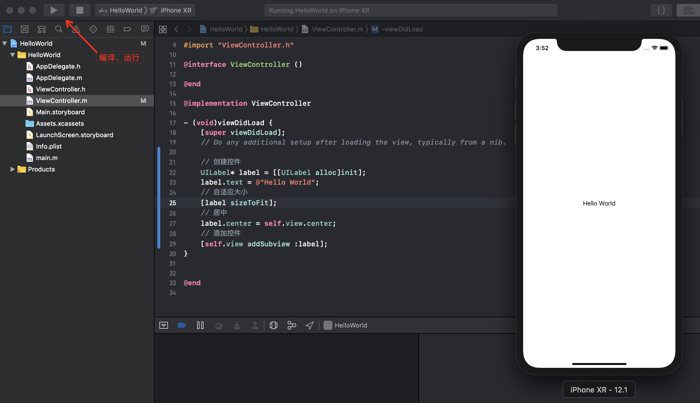
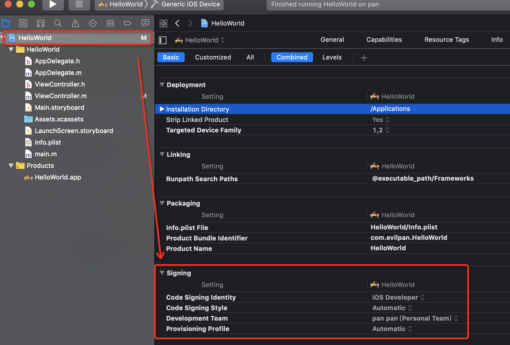

# iOS应用构建与部署小结

[evilpan](https://evilpan.com/) 收录于 类别 [Development](https://evilpan.com/categories/development/)

 2019-04-06 2019-04-06 约 3349 字  预计阅读 7 分钟 1445 次阅读 

[上篇文章](https://evilpan.com/2019/04/05/objc-basics/)介绍了Objective-C的基本概念，本文就来接着看如何创建我们的第一个简单iOS应用， 本着简单可复现的方式，我们会以尽可能小的成本来构建并在真机运行iOS应用。 也就是说， 不用越狱， 也无需开发者账号。当然，一台iPhone手机还是需要的，最好还有一台Mac。

# Xcode

iOS的应用必须要用Xcode来创建，步骤很简单：

1. 下载并打开Xcode
2. 选择ios -> Single View Application
3. 填写项目名、开发组、包名（Identifier）

项目创建成功后，目录结构如下：

```
$ tree HelloWorld/ HelloWorld/ ├── HelloWorld │  ├── AppDelegate.h │  ├── AppDelegate.m │  ├── Assets.xcassets │  │  ├── AppIcon.appiconset │  │  │  └── Contents.json │  │  └── Contents.json │  ├── Base.lproj │  │  ├── LaunchScreen.storyboard │  │  └── Main.storyboard │  ├── Info.plist │  ├── ViewController.h │  ├── ViewController.m │  └── main.m └── HelloWorld.xcodeproj    ├── project.pbxproj    ├── project.xcworkspace    │  ├── contents.xcworkspacedata    │  ├── xcshareddata    │  │  └── IDEWorkspaceChecks.plist    │  └── xcuserdata    │      └── pan.xcuserdatad    │          └── UserInterfaceState.xcuserstate    └── xcuserdata        └── pan.xcuserdatad            ├── xcdebugger            │  └── Breakpoints_v2.xcbkptlist            └── xcschemes                └── xcschememanagement.plist 
```

可以看到项目下有两个文夹，分别是源代码文件`HelloWorld`，以及工程文件`HelloWorld.xcodeproj`。 作为示例，我们可以修改`ViewController.m`文件，如下：

```
#import "ViewController.h" @interface ViewController () @end @implementation ViewController - (void)viewDidLoad {    [super viewDidLoad];    // Do any additional setup after loading the view, typically from a nib.        // 创建控件    UILabel* label = [[UILabel alloc]init];    label.text = @"Hello World";    // 自适应大小    [label sizeToFit];    // 居中    label.center = self.view.center;    // 添加控件    [self.view addSubview :label]; }  @end 
```

这样，一个Hello World小程序就完成了，左上角运行按钮，即可编译并在模拟器中运行，如下：


[](https://evilpan.com/img/2019-04-06-ios-basics/1.png)


在源代码框下方`Products`区域也能看到编译出的`HelloWorld.app`。 是不是很简单？好我们今天的文章就这样结束了，… 才怪！

# 命令行编译

为了更好地了解编译过程，我们可以脱离Xcode IDE，在命令行编译该项目：

首先，在项目目录中查看Schemes：

```
$ xcodebuild -list -project HelloWorld.xcodeproj
Information about project "HelloWorld":
    Targets:
        HelloWorld

    Build Configurations:
        Debug
        Release

    If no build configuration is specified and -scheme is not passed then "Release" is used.

    Schemes:
        HelloWorld
```

然后，选择一个scheme进行编译，这里是HelloWorld：

```
$ xcodebuild -scheme HelloWorld build
note: Using new build system
note: Planning build
note: Using build description from disk
Build system information
error: Signing for "HelloWorld" requires a development team. Select a development team in the project editor. (in target 'HelloWorld')

** BUILD FAILED **
```

凹，编译失败了，签名出错，因为万恶的资本主义坏苹果要求必须要每年99$或者299$去购买 Apple Developer Program 会员资格才能对应用进行合法签名，从而发布并运行我们创建的app。

但是这里写的这个简单APP只需要在我自己的手机上运行，所以并不需要这一步，禁用签名进行编译即可：

```
$ xcodebuild -scheme HelloWorld build CODE_SIGN_IDENTITY="" CODE_SIGNING_REQUIRED=NO
Build settings from command line:
    CODE_SIGN_IDENTITY =
    CODE_SIGNING_REQUIRED = NO

note: Using new build system
note: Planning build
note: Constructing build description
Build system information
warning: HelloWorld isn't code signed but requires entitlements. It is not possible to add entitlements to a binary without signing it. (in target 'HelloWorld')
...
Validate /Users/pan/Library/Developer/Xcode/DerivedData/HelloWorld-dnyjqrgxcjjobvfzytzhtzpmjlmx/Build/Products/Debug-iphoneos/HelloWorld.app (in target: HelloWorld)
...
Touch /Users/pan/Library/Developer/Xcode/DerivedData/HelloWorld-dnyjqrgxcjjobvfzytzhtzpmjlmx/Build/Products/Debug-iphoneos/HelloWorld.app (in target: HelloWorld)
...
** BUILD SUCCEEDED **
```

编译成功了！中间省略了很多输出信息，这里就不贴了。值得一提的是，生成的app并不是在当前项目目录下， 而是在`$HOME/Library/Developer/Xcode/DerivedData/$PROJECT-xxxx/{...}/HelloWorld.app`中， xxxx看起来是一段随机数。HelloWorld.app就是一个传统的苹果应用，其目录结构如下：

```
$ tree HelloWorld.app HelloWorld.app ├── Base.lproj │  ├── LaunchScreen.storyboardc │  │  ├── 01J-lp-oVM-view-Ze5-6b-2t3.nib │  │  ├── Info.plist │  │  └── UIViewController-01J-lp-oVM.nib │  └── Main.storyboardc │      ├── BYZ-38-t0r-view-8bC-Xf-vdC.nib │      ├── Info.plist │      └── UIViewController-BYZ-38-t0r.nib ├── HelloWorld ├── Info.plist └── PkgInfo 
```

其中HelloWorld就是ARM64的Mach-O文件：

```
$ file HelloWorld.app/HelloWorld HelloWorld.app/HelloWorld: Mach-O 64-bit executable arm64 
```

## 模拟器

iOS模拟器除了可以在Xcode启动，也可以通过命令行进行管理，如：

```
xcrun simctl help 
```

查看具体帮助：

```
$ xcrun simctl help install Install an app on a device. Usage: simctl install <device> <path> 
```

例如，我们要想在模拟器中启动上节编译好的HelloWorld.app，可以用以下命令：

```
# 查看当前设备列表，选择一个设备UDID xcrun simctl list devices # 打开并启动设备 open -a Simulator --args -CurrentDeviceUDID $UDID # 在启动的设备中安装我们的应用，注意需要app支持x86架构 xcrun simctl install booted /path/to/HelloWorld.app 
```

关于simctl的更多使用示例可以参考[这篇文章](https://shashikantjagtap.net/simctl-control-ios-simulators-command-line/)。

# 签名与ipa

上节说到我们可以不签名来编译APP，但对于真机而言，要想运行应用，签名是必须的。 在Xcode7以后，开发者可以只用自己的Apple ID来在自己的设备上运行iOS应用，设置如下：


[](https://evilpan.com/img/2019-04-06-ios-basics/0.png)


这样就可以通过USB在物理机上运行iOS应用了，不过要注意的是第一次启动时会提示不可信的开发者， 需要到`设置-通用`中进行信任。

## 什么是ipa

iOS应用与Android应用类似的一点是，最后安装到系统中的都是一个zip压缩包，对于Android而言后缀是apk， 而对于iOS而言则是ipa（iPhone Application Archive）。通常ipa会通过苹果加密（使用FairPlay DRM技术）。 所以一般我们想从手机上已经安装的应用还原出ipa需要先解密，也通常称为砸壳。

常见的解密方法有如下几种：

- [Clutch- Fast iOS executable dumper](https://github.com/KJCracks/Clutch)
- [dumpdecrypted - Dumps decrypted mach-o files from encrypted iPhone applications from memory to disk](https://github.com/stefanesser/dumpdecrypted)
- [frida-ios-dump](http://www.alonemonkey.com/2018/01/30/frida-ios-dump/)

当然这些都是需要越狱的，在非越狱的机器上可以通过iMazing提取，热门应用可以直接在第三方应用商店下载， 比如[AppCake](https://www.iphonecake.com/)。

## ipa打包

对于有源码的应用，我们可以使用Xcode进行打包，打包流程可以参考[stackoverflow中的一个回答](https://stackoverflow.com/questions/5499125/how-to-create-ipa-file-using-xcode)。 不过这需要有开发者账号。由于我们是自己使用，因此要找一种无需开发者账号的方法。

无需开发者账号的打包方式有很多，比如：

- [How to create ipa in xcode 6 without Apple Developer account?](https://stackoverflow.com/questions/26928721/how-to-create-ipa-in-xcode-6-without-apple-developer-account)
- [Export an IPA From Xcode Without an Apple Developer Account](https://medium.com/mλgnξtλr/how-to-export-a-ipa-file-from-xcode-without-a-dev-account-bac8b2645ad3)

这里使用命令行方式进行打包（archive&export）：

```
# archive xcodebuild archive -project HelloWorld/HelloWorld.xcodeproj -scheme HelloWorld -configuration Debug  -archivePath ./build/HelloWorld # export xcodebuild -exportArchive -archivePath ./build/HelloWorld.xcarchive -exportOptionsPlist exportOptions.plist -exportPath ./build 
```

这样就在`./build`目录下生成`HelloWorld.ipa`包了。其中`exportOptions.plist`如下：

```
<?xml version="1.0" encoding="UTF-8"?> <!DOCTYPE plist PUBLIC "-//Apple//DTD PLIST 1.0//EN" "http://www.apple.com/DTDs/PropertyList-1.0.dtd"> <plist version="1.0"> <dict>    <key>method</key>    <string>development</string> </dict> </plist> 
```

详细exportOptions的key/value值可以通过`xcodebuild -help`查看。

# ipa安装

无需AppStore的ipa的安装方法有下面几种（欢迎补充）：

- 使用Apple Configurator 2 工具（只支持MacOS）
- 使用Xcode安装
- 使用OTA部署方式安装
- 其他

## 使用Apple Configurator 2

Apple Configurator 2是苹果公司提供的一个部署和配置工具，可以直接从AppStore下载。 USB连接苹果手机后打开工具，图形界面操作，依次选择：

```
Add -> Apps -> Choose from my Mac
```

然后点击生成的ipa文件即可。不是很推荐这个工具，如果一定要用图形界面，还不如用下面的Xcode。

## 使用Xcode

同样是图形界面操作，USB连接手机后依次选择：

```
Window -> Devices and Simulators -> Devices
```

选择自己的手机后，点击`+`添加或者直接把ipa文件拖拽进来即可。

## OTA部署

OTA部署支持使用HTTPS的方式部署和分发你的ipa包，一个示例OTA链接地址如下：

```
itms-services://?action=download-manifest&url=https://example.com/ota.plist
```

`itms-services`是苹果上的自定义协议，会根据action下载并处理目标plist文件， `ota.plist`内容如下：

```
<plist version="1.0">  <dict>    <key>items</key>    <array>      <dict>        <key>assets</key>        <array>          <dict>            <key>kind</key>            <string>software-package</string>            <key>url</key>            <string>              https://example.com/app.ipa            </string>          </dict>        </array>        <key>metadata</key>        <dict>          <key>bundle-identifier</key>          <string>com.evilpan.helloworld</string>          <key>bundle-version</key>          <string>1</string>          <key>kind</key>          <string>software</string>          <key>title</key>          <string>一个有趣的APP</string>        </dict>      </dict>    </array>  </dict> </plist> 
```

解析后会从`https://example.com/app.ipa`下载应用，用户点击确定即可安装。 这里注意不论是ota.plist还是app.ipa的地址都是强制要求为**HTTPS**的， 因此若想以这种形式安装，还必须要去注册一个合法的SSL证书，也可以用免费的。

由于AppStore审核很严格，很多私人用的或者不合规的iOS软件都是通过OTA部署的形式分发的， 并且在会在安装说明中指引用户去`设置->通用->描述文件与设备管理`中手动点击信任该个人/企业开发者。

## 其他

除了上述方式，还有一些开源脚本可以帮助我们安装部署自己的应用，如[ios-deploy](https://github.com/ios-control/ios-deploy)， 只要连接USB输入以下命令即可安装：

```
$ ios-deploy -b HelloWorld.ipa
[....] Waiting for iOS device to be connected
------ Install phase ------
...
[ 65%] InstallingEmbeddedProfile
[ 70%] VerifyingApplication
[ 75%] CreatingContainer
[ 80%] InstallingApplication
[ 85%] PostflightingApplication
[ 90%] SandboxingApplication
[ 95%] GeneratingApplicationMap
[100%] Installed package HelloWorld.ipa
```

有点类似于Android的`adb install`，相当方便。个人建议直接使用源码编译而不是npm安装。

# 后记

本文从开发者的角度，介绍了iOS应用创建、编译、打包、测试、部署等方面， 从零开始构建并运行我们的第一个iOS程序。 既介绍了模拟器的安装测试方式， 也介绍了物理机上的打包和部署过程。其中很多地方尽可能的使用命令行去运行， 这有利于后续自动化的操作，也有利于我们理解各个选项所使用到的参数作用。

为了降低工作量，我们特地在没有越狱以及没有开发者账号的情况下完成上述操作。 下一篇，我们将尝试从攻击者的角度，实际“破解”一个iOS应用，Stay Tuned！

# 参考链接

- [iOS builds / ipa creation from the command line](https://stackoverflow.com/questions/32763288/ios-builds-ipa-creation-no-longer-works-from-the-command-line)
- [Setting up Frida Without Jailbreak on devices running iOS 12.1.4](https://medium.com/@dinezh.shetty/setting-up-frida-without-jailbreak-on-devices-running-latest-ios-12-4-27c7cfa6c9a2)
- [AppCake - Third party ipa download](https://www.iphonecake.com/)
- [dumpdecrypted - Dumps decrypted mach-o files from encrypted iPhone applications from memory to disk](https://github.com/stefanesser/dumpdecrypted)
- [Clutch- Fast iOS executable dumper](https://github.com/KJCracks/Clutch)
- [frida-ios-dump](http://www.alonemonkey.com/2018/01/30/frida-ios-dump/)
- [insert_dylib](https://github.com/Tyilo/insert_dylib)
- [Non-market App Distribution - Monaca Docs](https://docs.monaca.io/en/products_guide/monaca_ide/deploy/non_market_deploy)

更新于 2019-04-06