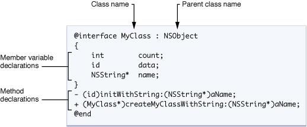
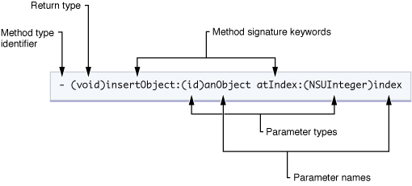

# Objective-C笔记

[evilpan](https://evilpan.com/) 收录于 类别 [Development](https://evilpan.com/categories/development/)

 2019-04-05 2019-04-05 约 5772 字  预计阅读 12 分钟 1253 次阅读 

为什么突然要搞ObjectiveC？因为清明比较闲，两三天正好用来学习下iOS的逆向分析。 逆向的第一步当然是先从正向了解，否则给你源代码都看不懂，反编译出来的就更别提了。 因此本篇文章作为简单学习ObjC的记录，不会涉及太深入的语法特性，简而言之就是——够用就行。

# 什么是Objective-C

**Objective-C**，简称OC，是一种通用、高级、面向对象的编程语言。它扩展了标准的ANSI C编程语言， 将Smalltalk式的消息传递机制加入到ANSI C中。当前主要支持的编译器有GCC和Clang（采用LLVM作为后端）。 Objective-C的商标权属于苹果公司，苹果公司也是这个编程语言的主要开发者。 苹果在开发NeXTSTEP操作系统时使用了Objective-C，之后被OS X和iOS继承下来。 现在Objective-C与Swift是OS X和iOS操作系统、及与其相关的API、Cocoa和Cocoa Touch的主要编程语言。

Objective-C是C语言的严格超集。这意味着任何C语言程序不经修改就可以直接通过Objective-C编译器， 在Objective-C中使用C语言代码也是完全合法的。Objective-C被描述为盖在C语言上的薄薄一层， 因为Objective-C的原意就是在C语言主体上加入面向对象的特性。OC项目中常用的拓展名如下：

| 扩展名 | 内容类型                                                     |
| ------ | ------------------------------------------------------------ |
| .h     | 头文件。头文件包含类，类型，函数和常数的声明。               |
| .m     | 源代码文件。这是典型的源代码文件扩展名，可以包含 Objective-C 和 C 代码。 |
| .mm    | 源代码文件。带有这种扩展名的源代码文件，除了可以包含Objective-C和C代码以外还可以包含C++代码。仅在你的Objective-C代码中确实需要使用C++类或者特性的时候才用这种扩展名。 |

# Hello, World!

学习任何一门语言之前，基本都需要做的就是编写并运行一个HelloWorld程序，对于OC而言则是如下：

```
#import <Foundation/Foundation.h> int main (int argc, const char * argv[]) {    @autoreleasepool {        NSLog (@"Hello, World!");    }    return 0; } 
```

使用clang进行编译：

```
clang -framework Foundation hello.m -o hello 
```

运行：

```
$ ./hello
2019-04-05 09:33:22.579 hello[75742:3312942] Hello, World!
```

So easy！我们学习Objective-C时记住要重点关注概念而不是具体的语言细节，避免陷入学而无用的境地。

# 关键概念

## 消息传递

Objective-C最大的特色是承自Smalltalk的消息传递模型（message passing）， 此机制与今日C++式之主流风格差异甚大。 Objective-C里，与其说对象互相调用方法， 不如说对象之间互相传递消息更为精确。此二种风格的主要差异在于调用方法/消息传递这个动作。 C++里类别与方法的关系严格清楚，一个方法必定属于一个类别，而且在编译时（compile time） 就已经紧密绑定，不可能调用一个不存在类别里的方法。但在Objective-C，类别与消息的关系比较松散， 调用方法视为对对象发送消息，所有方法都被视为对消息的回应。所有消息处理直到运行时（runtime） 才会动态决定，并交由类别自行决定如何处理收到的消息。也就是说，一个类别不保证一定会回应收到的消息， 如果类别收到了一个无法处理的消息，程序只会抛出异常，不会出错或崩溃。

C++里，送一个消息给对象（或者说调用一个方法）的语法如下：

```
obj.method(argument); 
```

Objective-C则写成：

```
[obj method: argument]; 
```

此二种风格各有优劣。C++强制要求所有的方法都必须有对应的动作，且编译期绑定使得函数调用非常快速。 缺点是仅能借由virtual关键字提供有限的动态绑定能力。Objective-C天生即具备鸭子类型之动态绑定能力， 因为运行期才处理消息，允许发送未知消息给对象。可以送消息给整个对象集合而不需要一一检查每个对象的类型， 也具备消息转送机制。同时空对象nil接受消息后默认为不做事，所以送消息给nil也不用担心程序崩溃。

举例来说，定义下面的程序：

```
@interface MyClass: NSObject // instance method - (int) add: (int) num1 secondNumber:(int) num2; // static method + (int) mul: (int) num1 secondNumber:(int) num2; @end @implementation MyClass - (int) add: (int) num1 secondNumber:(int) num2 {    return num1 + num2; } + (int) mul: (int) num1 secondNumber:(int) num2 {    return num1 * num2; } @end 
```

其中`add`方法是实例函数，`mul`是类函数，调用过程如下：

```
int main() {     int a = 3, b = 4;    MyClass *myClass = [[MyClass alloc]init];    int c = [myClass add:a secondNumber:b];    int d = [MyClass mul:a secondNumber:b]; } 
```

编译后在调试器中查看汇编可以看到，add方法的汇编是：

```
    0x100000ea2: mov    rsi, qword ptr [rbp - 0x18]
    0x100000ea6: mov    edx, dword ptr [rbp - 0x8]
    0x100000ea9: mov    ecx, dword ptr [rbp - 0xc]
    0x100000eac: mov    rdi, qword ptr [rip + 0x122d] ; "add:secondNumber:"
    0x100000eb3: mov    qword ptr [rbp - 0x28], rdi
    0x100000eb7: mov    rdi, rsi
    0x100000eba: mov    rsi, qword ptr [rbp - 0x28]
    0x100000ebe: call   qword ptr [rip + 0x13c]   ; (void *)0x00007fff6344e000: objc_msgSend
```

其实就是转换为：

```
objc_msgSend(myClass, "add:secondNumber:", 3, 4) 
```

所有的Objective-C方法调用都通过`objc_msgSend`进行调用，且实例和方法名称分别为前两个参数。 这也是为什么OC方法调用称之为消息传递的原因。

## 字符串

作为C语言的超集，Objective-C 支持 C 语言字符串方面的约定。也就是说，单个字符被单引号包括， 字符串被双引号包括。然而，大多数Objective-C通常不使用C语言风格的字符串。 反之，大多数框架把字符串传递给NSString对象。NSString类提供了字符串的类包装， 包含了所有你期望的优点，包括对保存任意长度字符串的内建内存管理机制，支持Unicode，printf风格的格式化工具， 等等。因为这种字符串使用的非常频繁，Objective-C提供了一个助记符`@`可以方便地从常量值创建NSString对象。 如下面的例子所示：

```
// 从一个C语言字符串创建Objective-C字符串 NSString*  fromCString = [NSString stringWithCString:"A C string"  encoding:NSASCIIStringEncoding]; // 使用助记符@ NSString* name = @"PANN"; NSString* line = [NSString stringWithFormat:@"Hello, %s\n", @"String"]; 
```

## 类(class)

类是面向对象语言中最重要的一个概念，Objective-C同样支持类。下图是一个名为MyClass的类声明介绍：

[](https://evilpan.com/img/2019-04-05-objc-basics/1.png)


### 声明

遵循C语言的规范，类声明一般定义在.h头文件中。类声明以关键字@interface作为开始，@end作为结束。 其中类方法前的+号表示类方法，-号表示实例方法。一个对应的C++类定义如下：

```
public MyClass : NSObject {  protected:  int count;  id data;  NSString *name;  public:  id intWithString(NSString *aName);  static MyClass *createMyClassWithString(NSString *aName); }; 
```

### 实现

遵循C语言的规范，类实现一般定义在对应的.m文件中。类实现包含了公开方法的实现， 以及定义私有（private） 变量及方法。 以关键字@implementation作为区块起头，@end结尾。 上述类的一个实现如下：

```
@implementation MyClass {  NSString *secret;  -(id) initWithString: (NSString*)aName {    self.name = aName;    return 0;  }  +(MyClass)createMyClassWithString:(NSString*)aName {    MyClass * my = [[MyClass alloc] init];    my.name = aName;    return my;  } } 
```

> 头文件（类声明）中定义的属性默认为protected，方法为public。而类实现中定义的属性为private。 当然也可以使用@public、@private等助记符来覆盖默认行为。

### 实例化

实例化即创建对象。Objective-C创建对象需通过alloc以及init两个消息。alloc的作用是分配内存， init则是初始化对象。 init与alloc都是定义在NSObject里的方法，父对象收到这两个信息并做出正确回应后， 新对象才创建完毕。如上述类中：

```
MyClass * my = [[MyClass alloc] init]; 
```

在Objective-C 2.0里，若创建对象不需要参数，则可直接使用new：

```
MyClass * my = [MyClass new]; 
```

仅仅是语法上的精简，效果完全相同。

若要自己定义初始化的过程，可以重写init方法，来添加额外的工作。（用途类似C++ 的构造函数constructor）， 如下：

```
- (id) init {    if ( self=[super init] ) {   // 必须调用父类的init        // do something here ...    }    return self; } 
```

## 方法(method)

在上节介绍类的时候已经见过了一些方法的定义和使用，第一次接触Objective-C的人肯定会觉得很奇怪（比如我就觉得这语法比Golang还奇葩）， 但是只要接收了这种设定，还是可以慢慢习惯的。

### 声明

下图为Objective-C内置数组类型的insertObject方法声明：


[](https://evilpan.com/img/2019-04-05-objc-basics/0.png)


方法实际的名字(insertObject:atIndex:)是所有方法标识关键的级联，包含了冒号。冒号表明了参数的出现。 如果方法没有参数，你可以省略第一个(也是唯一的)方法标识关键字后面的冒号。本例中，这个方法有两个参数。 该函数转换成类似的C++表示如下：

```
void insertObject:atIndex:(id anObject, NSUInteger index); 
```

### 调用

调用一个方法实际上就是传递消息到对应的对象。这里消息就是方法标识符以及传递给方法的参数信息。 发送给对象的所有消息都会动态分发，这样有利于实现Objective-C类的多态行为。 也就是说，如果子类定义了跟父类的具有相同标识符的方法，那么子类首先收到消息， 然后可以有选择的把消息转发（也可以不转发）给他的父类。

消息被中括号( [ 和 ] )包括。括号中接收消息的对象在左边，消息及其参数在右边。 例如，给myArray变量传递消息insertObject:atIndex:消息，可以使用如下的语法：

```
[myArray insertObject:anObj atIndex:0]; 
```

消息允许嵌套。也就是说，假如你有一个myAppObject对象，该对象有getArray方法获取数组， 有getObjectToInsert方法获取元素，那么嵌套的消息可以写成：

```
[[myAppObject getArray] insertObject:[myAppObject getObjectToInsert] atIndex:0]; 
```

## 属性(attribute)

属性没什么好说的，和C++的类属性类似。不过在Objective-C 2.0引入了新的语法以声明变量为属性， 并包含一可选定义以配置访问方法的生成。属性总是为公共的，其目的为提供外部类访问（也可能为只读） 类的内部变量的方法。属性可以被声明为“readonly”，即只读的，也可以提供储存方法包括“assign”， “copy”或“retain”（简单的赋值、复制或增加1引用计数）。默认的属性是原子的， 即在访问时会加锁以避免多线程同时访问同一对象，也可以将属性声明为“nonatomic”（非原子的）， 避免产生锁。

定义属性的例子如下：

```
@interface Person : NSObject {    @public        NSString *name;    @private        int age; } @property(copy) NSString *name; @property(readonly) int age; -(id)initWithAge:(int)age; @end 
```

### synthesize

属性的访问方法由@synthesize关键字来实现，它由属性的声明自动的产生一对访问方法。 另外，也可以选择使用@dynamic关键字表明访问方法为手动提供。

```
@implementation Person @synthesize name; @dynamic age; -(id)initWithAge:(int)initAge {    age = initAge; // 注意：直接赋给成员变量，而非属性    return self; } -(int)age {    return 18; // 注意：并非返回真正的年龄 } @end 
```

### 访问

属性可以利用传统的消息表达式、点表达式或"valueForKey:"/“setValue:forKey:“方法对来访问。如下：

```
Person *aPerson = [[Person alloc] initWithAge: 53]; // 修改属性 aPerson.name = @"Steve"; [aPerson setName: @"Steve"]; // 读取属性 NSString *tmp; tmp = [aPerson name]; // 消息表达式 tmp = aPerson.name;	  // 点表达式 tmp = aPerson->name;  // 直接访问成员变量 tmp = [aPerson valueForKey:@"name"]; // property访问 
```

## 协议(Protocol)

协议是一组没有实现的方法列表，任何的类均可采纳协议并具体实现这组方法。简而言之就是接口， 可以类比Java的interface，或者C++的纯虚函数，表述一种is-a的概念。

协议以关键字@protocol作为区块起始，@end结束，中间为方法列表。如下：

```
@protocol Mutex - (void)lock; - (void)unlock; @end 
```

若要声明实现该协议，可以使用尖括号<>，如下：

```
@interface SomeClass : SomeSuperClass <Mutex> @end 
```

一旦SomeClass表明他采纳了Mutex协议，SomeClass就有义务实现Mutex协议中的两个方法：

```
@implementation SomeClass - (void)lock {  // 实现lock方法 } - (void)unlock {  // 实现unlock方法 } @end 
```

## 动态类型

类似于Smalltalk，Objective-C具备动态类型：即消息可以发送给任何对象实体，无论该对象实体的公开接口中有没有对应的方法。 虽然Objective-C具备动态类型的能力， 但编译期的静态类型检查依旧可以应用到变量上。 以下三种声明在运行时效力是完全相同的， 但是三种声明提供了一个比一个更明显的类型信息， 附加的类型信息让编译器在编译时可以检查变量类型，并对类型不符的变量提出警告。

下面三个方法，差异仅在于参数的形态：

```
- setMyValue1:(id) foo;
- setMyValue2:(id <aProtocol>) foo;
- setMyValue3:(NSNumber*) foo;
```

> Objective-C中的id类型类似于void指针，但是被严格限制只能使用在对象上。

## 消息转发

一个对象收到消息之后，他有三种处理消息的可能手段，第一是回应该消息并运行方法，若无法回应， 则可以转发消息给其他对象，若以上两者均无，就要处理无法回应而抛出的例外。只要进行三者之其一， 该消息就算完成任务而被丢弃。若对"nil”（空对象指针）发送消息，该消息通常会被忽略， 只不过对于某些编译器选项可能会抛出异常。

Objective-C运行时在Object中定义了一对方法：

**转发方法**：

```
- (retval_t) forward:(SEL) sel :(arglist_t) args; // with GCC - (id) forward:(SEL) sel :(marg_list) args; // with NeXT/Apple systems 
```

**响应方法**：

```
- (retval_t) performv:(SEL) sel :(arglist_t) args;  // with GCC - (id) performv:(SEL) sel :(marg_list) args; // with NeXT/Apple systems 
```

> GCC和NeXT/Apple编译器的区别是返回值和参数类型不同。

希望实现转发的对象只需用新的方法覆盖以上方法来定义其转发行为而无需重写响应方法`performv::`， 因为后者只是单纯的对响应对象发送消息并传递参数。其中，`SEL`类型是Objective-C中消息的类型。

## 类别(Category)

Objective-C借用并扩展了Smalltalk实现中的"分类"概念，用以帮助达到分解代码的目的。

一个分类可以将方法的实现分解进一系列分离的文件。程序员可以将一组相关的方法放进一个分类， 使程序更具可读性。举例来讲，可以在字符串类中增加一个名为"拼写检查"的分类， 并将拼写检查的相关代码放进这个分类中。

分类中的方法是在运行时被加入类中的，这一特性允许程序员向现存的类中增加方法， 而无需持有原有的代码， 或是重新编译原有的类。 例如若系统提供的字符串类的实现中不包含拼写检查的功能，可以增加这样的功能而无需更改原有的字符串类的代码。

在运行时，分类中的方法与类原有的方法并无区别，其代码可以访问包括私有类成员变量在内的所有成员变量。 若分类声明了与类中原有方法同名的函数，则分类中的方法会被调用。因此分类不仅可以增加类的方法， 也可以代替原有的方法。这个特性可以用于修正原有代码中的错误，更可以从根本上改变程序中原有类的行为。 若两个分类中的方法同名，则被调用的方法是不可预测的。

分类的声明如下：

```
@interface ClassName (CategoryName) @end 
```

下面是一个具体的例子，通过MyAdditions分类，动态的给NSString类中添加getCopyRightString方法：

```
#import <Foundation/Foundation.h> @interface NSString(MyAdditions) +(NSString *)getCopyRightString; @end @implementation NSString(MyAdditions) +(NSString *)getCopyRightString {   return @"Copyright evilpan.com 2019"; } @end int main(int argc, const char * argv[]) {   NSAutoreleasePool * pool = [[NSAutoreleasePool alloc] init];   NSString *copyrightString = [NSString getCopyRightString];   NSLog(@"Accessing Category: %@", copyrightString);      [pool drain];   return 0; } 
```

# 小结

现在，我们已经了解了Objective-C语言的基本语法和关键概念，可以开始自己编写简单的程序了。 一门语言只是一个工具，常用常新，如果不使用，学得再深也很容易遗忘。 当然，本文介绍的Objective-C特性只是一小部分，但我们仍然可以先用起来， 等遇到具体语法或者API时候再查阅文档（如spec、[tutorialspoint](https://www.tutorialspoint.com/objective_c/objective_c_overview.htm)等）即可。 使用得越多，需要查阅文档但频率也会越少，学习没有捷径可言。