# 一：NAT类型

### 基于UDP的P2P应用需要考虑NAT的类型，因为不同的NAT组合的穿透的方式并不一致，有的能通， 有的不能通。一般来讲， NAT可以分为四种类型，分别是:

[](javascript:void(0);)

```
1,  全锥型(Full Cone)

2,  受限锥型(Restricted Cone)， 或者说是IP受限锥型

3,  端口受限锥型(Port Restricted Cone), 或者说是IP + PORT受限锥型

4,  对称型(Symmetric)
```

[](javascript:void(0);)

其中**1,2,3属于同一种类型，都是锥型**，区别只是路由器的不同的安全策略。还有些NAT不属于这四种中的任何一种，就不在本文的讨论范围了。

# 二：为什么有四种类型的NAT

NAT缓解了IPV4地址不够用的问题，同时也带了限制，那就是**NAT外部的主机无法主动跟位于NAT内部的主机通信，NAT内部主机想要通信，必须主动和公网的一个IP通信，路由器负责建立一个映射关系，从而实现数据的转发， 这就是NAT的工作原理**。

## （一）NAT使用案例

[](javascript:void(0);)

```
公网server1 ip是1.1.1.1， 监听端口是1111

公网server2 ip是2.2.2.2， 监听端口是2222

NAT router ip是8.8.8.8

NAT内部client是192.168.0.3
```

[](javascript:void(0);)

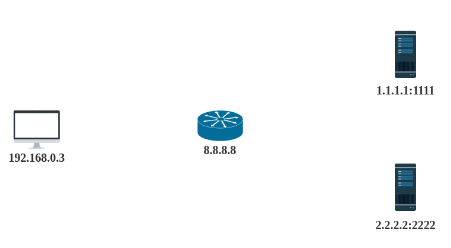

client发送数据的时候，不管是tcp还是udp必须本地绑定一个端口，一般来讲，这个过程都是自动的。

假定client(192.168.0.3, 100)给 server(1.1.1.1, 1111)发送报文，报文到达路由器，

路由器在自己的公网ip上开辟一个端口800，从而建立了一个隐射关系(8.8.8.8, 800)<--->(192.168.0.3, 100), 

建立映射关系后，所以(192.168.0.3, 100)和(1.1.1.1, 1111)之间的报文都通过这个映射关系进行转发。

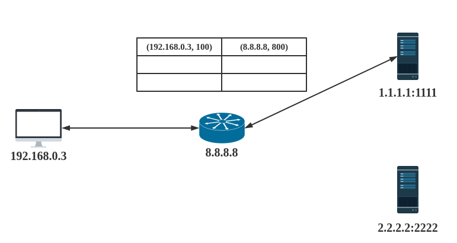

## （二）NAT之间主要的区别分两种情况讨论

### 1:client(192.168.0.3, 100)和server(1.1.1.1, 1111)在路由器上建立好映射关系后，如果client(192.168.0.3, 100)又给(2.2.2.2, 2222)发送数据，路由器该怎么处理呢?

```
1,  复用旧的映射关系(8.8.8.8, 800)<--->(192.168.0.3, 100)和(2.2.2.2, 2222)通信, 这就是锥型(Cone) NAT---（分为下面的3个小类）

2,  创建新的映射关系(8.8.8.8, 801)<--->(192.168.0.3, 100)和(2.2.2.2, 2222)通信, 这就是对称型NAT
```

注: (8.8.8.8, 801)只是举例，到底用什么端口取决于路由器的端口管理策略，总之是另外的一个端口，有的路由器有多个公网IP，不同的IP也会参与到这个映射关系中。

### 2:client(192.168.0.3, 100)和server(1.1.1.1, 1111)在路由器上建立好映射关系后，如果这个时候路由器(8.8.8.8)在800端口上收到从另外一台server(2.2.2.2, 2222)发来的数据，是不是应该转发给(192.168.0.3, 100)呢？

有四种情况:

[](javascript:void(0);)

```
1, 无条件转发给(192.168.0.3, 100)， 这就是全锥型(Full Cone)NAT。

2, 如果(192.168.0.3, 100)之前给(2.2.2.2)发送过数据，则转发， 这就是受限锥型(Restricted Cone)。

3, 如果(192.168.0.3, 100)之前给(2.2.2.2, 2222)发送过数据，则转发， 这就是端口受限锥型(Port Restricted Cone)。

4, 丢弃报文，拒绝转发, 这就是对称型NAT。
```

[](javascript:void(0);)

从上面也描述也可以看出，安全性系数, 对称型 > 端口受限锥型 > 受限锥型 > 全锥型

## （三）不同NAT的穿透性

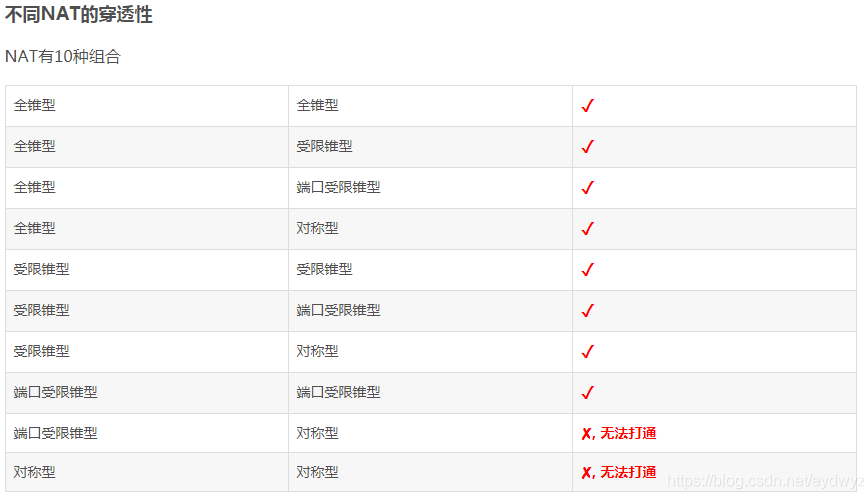

对称nat无法穿透，这个说法不正确，**对称nat与全椎full cone nat、对称nat 与 ip受限椎型cone**，是可以穿透的，**对称nat与 端口受限、对称nat与对称nat**，不可穿透。
类型：

```
1、full cone 全椎
2、Restricted Cone ip受限
3、port Restricted Cone 端口受限
4、Symmetric 对称。
```

### 穿透关系：上述4种类型，如果定义他们的值为序列号，N为序列号相加。

```
则N<=6可穿透。2 和 4 序列相加 = 6 则可穿透。 
3(端口受限)和4（对称）= 7 不可穿透。
```

# 三：p2p网络中的NAT穿透问题---NAT的原理和类型

## （一）完全圆锥型NAT (Full Cane NAT)

### **完全圆锥型的NAT,将从同一内部IP地址和端口来的所有请求，都映射到相同的外部IP地址和端口。而且，任何外部主机通过向映射的外部地址发送报文，可以实现和内部主机进行通信。**

这是一种**比较宽松的策略**，**只要建立了内部网络的IP地址和端口与公网IP地址和端口的映射关系，则所有Internet上的主机都可以访问该NAT之后的主机！！！** 

 

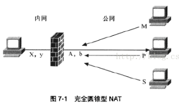

在图中，**NAT会将内网地址{X:y} (x代表内网主机的IP地址，Y代表端口)映射成公网地址{A:b}(A代表映射的公网IP地址，b代表映射的端口)并绑定。任何数据分组都可以通过地址{A:b}送到此内网主机。**

## （二）受限圆锥型NAT ( Restricted Cone NAT)--IP受限

受限圆锥型NAT也是将从相同的内部IP地址和端口来的所有请求，映射到相同的公网IP地址和端口。

### 但是与完全圆锥型NAT不同，当且仅当内网主机之前己经向公网主机(假设IP地址为P)发送过数据分组，此公网主机才能够向内网主机发送数据分组。

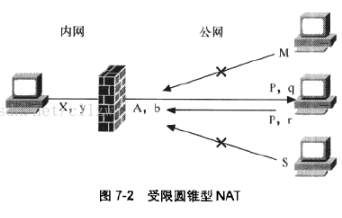

在图中，**NAT会将内网地址{x:y}映射成公网地址{A:b〕并绑定，只有源地址为P的分组才能和此内网主机通信。**

## （三）端口受限圆锥型NAT ( Port Restricted Cone NAT)--IP+port受限

### 类似于受限圆锥型NAT，但更严格。**端口受限圆锥型NAT增加了端口号的限制，当且仅当内网主机之前已经向公网主机发送了数据分组，公网主机才能和此内网主机通信。**

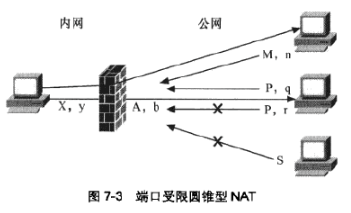

在图中，NAT会将内网地址{X:y}映射成公网地址{A:b}并绑定，**由于内网主机之前己经分别与地址为M,端口为n的公网主机以及地址为P,端口为q的公网主机通信**，所以**只有来自这两个公网地址和端口的分组才能到达内网主机**。

## （四）对称型NAT CSymmetric NAT)----重点理解

### 对称型NAT把从**同一内网地址和端口****到相同的地址和端口的所有请求**，**都映射到同一个公网地址和端口**。

如果**同一个内网主机，用相同的内网地址和端口向另一个地址发送数据分组，则会使用不同的映射**，**而且公网主机只有在接收到数据分组后，才能向与发送分组的内网主机进行通信**。可见，对称性NAT是所有NAT类型中限制最为严格的。

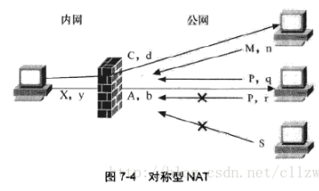

在图中，对称型NAT会将内网地址{X:y}转换成公网地址{A:b}**并绑定为{X:y}|{A:b}<一>{P:q}**。这就意味着NAT只允许地址{A:b}接收来自{P:q}的分组，将它转给{X:y} 。**当客户机请求一个不同的公网地址{M:n}时，NAT会新分配一个外部端口{[C:](https://www.baidu.com/s?wd=C%3A&tn=24004469_oem_dg&rsv_dl=gh_pl_sl_csd)d}** 。 

## 转载自：https://blog.csdn.net/eydwyz/article/details/87364157

## [P2P技术详解(一)：NAT详解——详细原理、P2P简介 ](http://www.52im.net/thread-50-1-1.html)

# 四：NAT类型判断

NAT类型的检测，查看主机所在的NAT网关（提供真正的外网IP地址，而不是伪外网IP地址）是属于哪种NAT类型，是否可以打洞成功。

下面就看一下这个整体的判断逻辑，当然在这之前要有一个限定条件，就是在云端一定要部署一个[STUN服务](https://www.cnblogs.com/ssyfj/p/14791972.html)。这个**STUN服务要有两个IP地址和端口**，这两个IP地址的作用稍后会在逻辑判断的过程中介绍。

## （一）NAT类型判断流程

1.首先客户端要发送一个ECHO请求给服务端（提供STUN服务），服务端收到请求之后，通过同样的IP地址和端口，给我们返回一个信息回来。


2.那在客户端就要等这个消息回复，那么设置一个超时器，看每个消息是否可以按时回来，那如果我们发送的数据没有回来，则说明这个UDP是不通的，我们就不要再进行判断了（网络不通，不需要判断）。

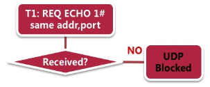

3.如果我们收到了**服务端的响应**，那么**就能拿到我们这个客户端出口的公网的IP地址和端口**，这个时候要判断一下**公网的IP地址和本机的IP地址（NAT内部地址！！！）**是否是一致的，如果是一致的，说明本机没有在NAT之后而是一个公网地址；

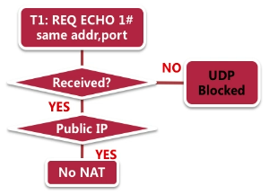

4.接下来要做进一步判断，就是判断我们的公网地址是不是一个完全的公网地址，这时我们再**发送一个信息到第一个IP地址和端口**，那服务端收到这个请求之后呢，它**使用第二个IP地址和端口给我们回消息**，如果我们真是一个完全的公网IP地址和端口提供一个服务的话，那其他任何公网上的主机都可以向我发送请求和回数据，这时候我都是能收到的，那如果我能收到，那就说明就是一个公网的地址，所以我们就没有在NAT之后就完全可以接收数据了。

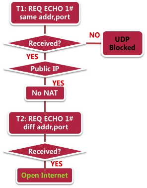

5.那如果我们收不到，那说明我是在一个防火墙之后，而且一个对称的防火墙。（可以认为与对称NAT一样）

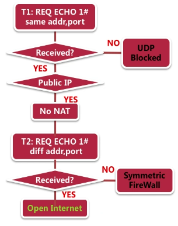

6.如果我**收到的公网的IP与我本地的IP不一致，那就说明我们确实是在NAT之后，那既然是在NAT之后我们就要对各种类型作判断了**。

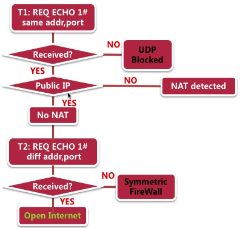

7.这时我们再发送一个请求到**服务端的第一个IP地址和端口**，而**服务端通过第二个IP地址和端口**给我们回消息，那这时候我们要判断NAT的类型是不是完全锥型，如果我们出去一个请求，在我们的NAT服务和网关上建立了一个内网地址和外网地址的映射表之后，那其他公网上的主机都可以向我这个公网IP地址（含端口）发送消息，并且我**可以接收到**，那么这个时候可以收到的话，我们就是一个**完全锥型NAT**。

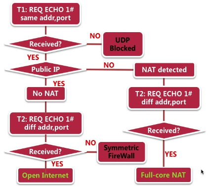

8.那么如果**收不到的话**，需要做进一步的判断，这时候需要（**客户端主动发送数据，用来探测对称型**）**向服务端的第二个IP地址和端口发送数据**，那么此时服务端会用同样的IP地址和端口给我们回数据，那么**这时候它也会带回一个公网的IP地址来，但是如果我们的出口，就是向第二个IP地址发送了请求带回的外网IP与端口与我们第一发送的请求带回的IP地址和端口（主要是端口）如果是不一样的**，那就说明是**对称型NAT**；---**对称型NAT每次出去都会在映射表上形成不同的外网IP地址和端口**！！！！

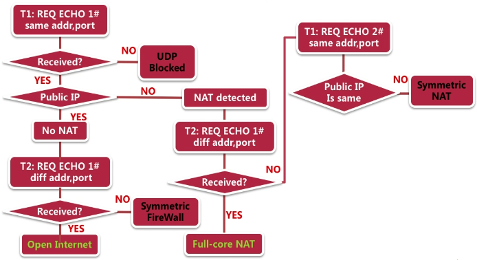

9.**如果一样（没有修改映射表，没有新建一个映射关系，即是说明客户端的外网IP和端口不变）**就说明是限制型的，限制型分为两种一种是IP限制型，一种是端口限制型，所以还需要做进一步的检测。这个时候**客户端主动再向服务端第一个IP地址和端口发送一个请求**，**如果服务端回信息时使用的是之前回复消息所使用的同一个IP地址，但是不是同一个的端口号**，那么这时候我们就可以判断是否可以接收到，**如果不能接收到，说明是对端口做了限制，所以是端口限制型的NAT**，**如果可以收到就说明是一个IP地址限制型的NAT。**

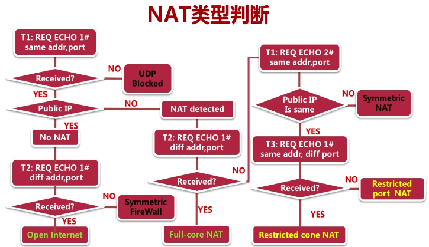

经过这样一个逻辑判断之后 ，我就可以知道我们自己这台在内网的主机是什么NAT类型了。

## （二）回顾判断过程

了解了逻辑之后，我们再来看一下检测过程：

1.首先是我们的客户端，向服务端的第一IP地址和端口，发送一个请求;之后服务端回送一个响应（包含客户端的官网IP和端口信息）给客户端。如果回来这个地址（响应信息中获取得到的IP地址）和我们之前发送的地址（NAT内网地址）是一致的，那就是公网的。如果不一致说明我们是在NAT之后，这是第一次检测。**----检测是公网主机还是位于NAT网关后面的内网主机（不用太考虑下图中的客户端的端口信息）**

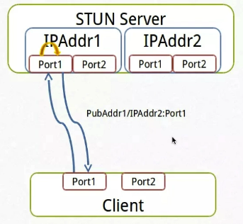

2.再接下来就是**检测是对称型还是限制性NAT**。首先，如左图所示客户端向服务器第一个IP地址发送了一个请求 ，然后再如右图所示，客户端向服务端第二个IP地址发送一个请求。**如果两次回复的响应中的主机公网IP地址和端口与上次回来的公网IP地址与端口是不一样的，它就是对称型NAT；如果一样还需要进一步判断。**

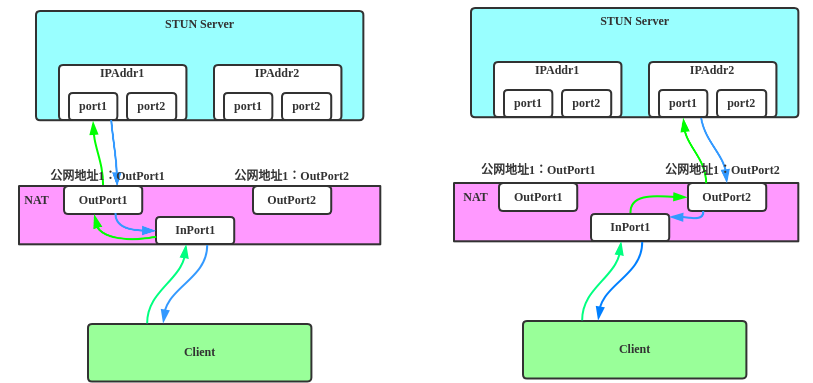

3.接下来检测**是否是完全锥型NAT**。是否再接下来就是客户端向服务端第一个IP地址发送了一个请求 ，然后它通过第二个IP地址给我回一个请求，如果可以接收到，就表示为完全椎型，否则不是完全椎型。**（不用太考虑下图中的客户端的端口信息）**

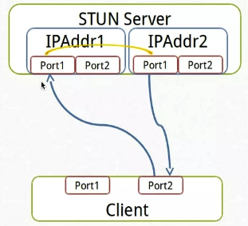

4.紧接着再发送一个请求到第一个这个地址，那么它用这个地址的第二个端口向我回消息，如果这时候我是能收到的，说明是**IP地址限制锥型NAT**，如果不能收到说明是**端口限制锥型**。

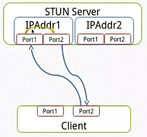

以上就是我们NAT检测基本的一个过程。


----


简简单单测一下当前网络nat类型: https://github.com/nthack/NatTypeChecker

浏览器f12 输入js代码:

```js
function parseCandidate(line) {
  var parts;
  // Parse both variants.
  if (line.indexOf('a=candidate:') === 0) {
    parts = line.substring(12).split(' ');
  } else {
    parts = line.substring(10).split(' ');
  }

  var candidate = {
    foundation: parts[0],
    component: parts[1],
    protocol: parts[2].toLowerCase(),
    priority: parseInt(parts[3], 10),
    ip: parts[4],
    port: parseInt(parts[5], 10),
    // skip parts[6] == 'typ'
    type: parts[7]
  };

  for (var i = 8; i < parts.length; i += 2) {
    switch (parts[i]) {
      case 'raddr':
        candidate.relatedAddress = parts[i + 1];
        break;
      case 'rport':
        candidate.relatedPort = parseInt(parts[i + 1], 10);
        break;
      case 'tcptype':
        candidate.tcpType = parts[i + 1];
        break;
      default: // Unknown extensions are silently ignored.
        break;
    }
  }
  return candidate;
};

var candidates = {};
var pc = new RTCPeerConnection({iceServers: [
    {urls: 'stun:stun1.l.google.com:19302'},
    {urls: 'stun:stun2.l.google.com:19302'}
]});
pc.createDataChannel("foo");
pc.onicecandidate = function(e) {
  if (e.candidate && e.candidate.candidate.indexOf('srflx') !== -1) {
    var cand = parseCandidate(e.candidate.candidate);
    if (!candidates[cand.relatedPort]) candidates[cand.relatedPort] = [];
    candidates[cand.relatedPort].push(cand.port);
  } else if (!e.candidate) {
    if (Object.keys(candidates).length === 1) {
      var ports = candidates[Object.keys(candidates)[0]];
      console.log(ports.length === 1 ? 'normal nat' : 'symmetric nat');
    }
  }
};
pc.createOffer()
.then(offer => pc.setLocalDescription(offer))
```

`normal nat`: 表示为普通NAT（非对称NAT）

`symmetric nat`：表示对称型NAT