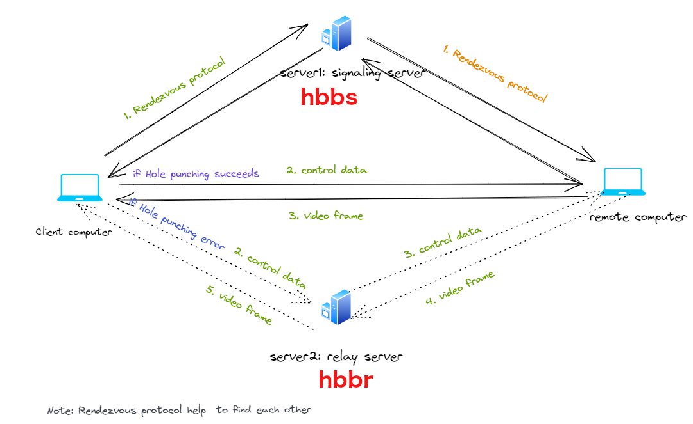

# Rustdesk architecture

## RustDesk 介绍

RustDesk 是类似于 TeamViewer 的远程控制 APP，核心语言是 Rust。

## RustDesk 组成

### 服务端

https://github.com/kyrosle/rustdesk-server

服务端包括 relay server 和 signaling server。

- signaling server，监听 21116 端口，
  负责为客户端提供 peer 端的地址和公钥 pk、relay server 的地址，类似于 WebRTC 中的 signaling server。
- relay server，监听 21117 端口，
  负责在多个客户端之间转发 video、audio 流，类似于 WebRTC 中的 STUN/TURN.

what does the server do, why do I need it?

- It is primarily used to help your RustDesk clients to find each other.
- Once this is done, it helps you try and get a direct connection between them.
- If this fails and your client and controlled devices cannot talk directly to each other, the relay part of side the server will be used to handle the connection.

the RustDesk server hardware requirement:

The hardware requirements are very low, the minimum configuration of the cloud server is enough, and the CPU and memory requirements are the minimum. Regarding the network size, if the TCP hole punching direct connection fails, the relay traffic will be consumed. The traffic of a relay connection is between 30k-3M/s (1920x1080 screen), depending on the resolution settings and screen update. If it is only for office work demand, the traffic is around 100K/s.

### 客户端

https://github.com/kyrosle/rustdesk

代码执行流：

- 启动后，src/ui.rs 会打开 ui/index.tis，同时启动 src/rendezvous_mediator.rs:RendezvousMediator 向 signaling server 注册自己的 id 和公钥 pk。
- 点击 “Connect” 后，会打开 ui/remote.tis，ui/remote.rs 中会创建 src/client.rs:Client，Client 会与 peer 端进行交互。

#### 组成

- libs/hbb_common: 视频编解码, 配置, tcp/udp 封装, protobuf, 文件传输相关文件系统操作函数, 以及一些其他实用函数
- libs/scrap: 屏幕截取
- libs/enigo: 平台相关的鼠标键盘输入
- src/ui: GUI
- src/server: 被控端服务音频、剪切板、输入、视频服务、网络连接的实现
- src/client.rs: 控制端
- src/rendezvous_mediator.rs: 与rustdesk-server保持UDP通讯, 等待远程连接（通过打洞直连或者中继）
- src/platform: 平台服务相关代码
- flutter: 移动版本的Flutter代码
- flutter/web/js: Flutter Web版本中的Javascript代码

## 网络交互

### 两个客户端在同一网段

位于同一个网段下的两个客户端建立安全连接过程：

- 两个 client 启动后，都会生成自己的 (sk, pk)，并把自己的 pk 注册到 signaling server 上。
- 当 client A 想要向 client B 发起连接时，signaling server 会将 client B 的 pk 发送给 client A，并通知 client B 将 client B 的 signed id 发送给 client A。
- client B 用自己的 sk 对 id 进行签名，得到 signed id，并生成 (B_pk_b, B_sk_b)，将 signed id 和 B_pk_b 发送给 client A
- client A 收到 client B 的 signed id 后，如果通过 client B 的 pk 解出了 id，说明 client B 的 signed id 正确。接着会生自己的 (A_pk_b, A_sk_b)、nonce 以及 symmetric_key，并采用 (nonce, B_pk_b, A_sk_b) 对 symmetric_pk 进行加密得到 sealed_symmetric_key，然后将 (sealed_symmetric_pk, A_pk_b) 发送给 client B
- client B 生成 nonce，该 nonce 与 client A 的相等，采用 (nonce, A_pk_b, B_sk_b) 从 sealed_symmetirc_key 中解出 symmetric_key
- 以后，client A 和 client B 进行通信时，都会用 symmetirc_key 进行加密和解密。

### 两个客户端不在同一网段

在上一个图的基础上，会增加 relay server 的中转。比如当 5: punch hole request 失败后，client A 会向 relay server 发出 request relay，后面与 client B 的交互都会由 relay server 中转。

rendezvous protocol: https://en.wikipedia.org/wiki/Rendezvous_protocol
