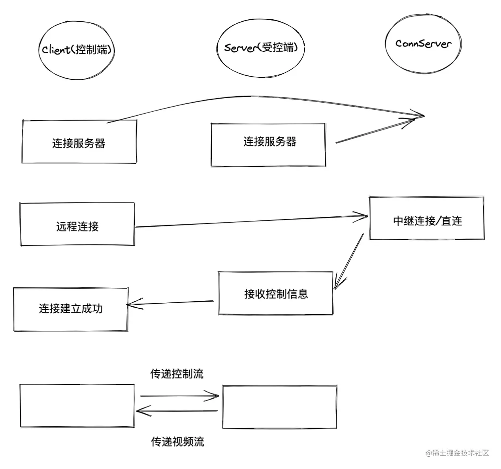
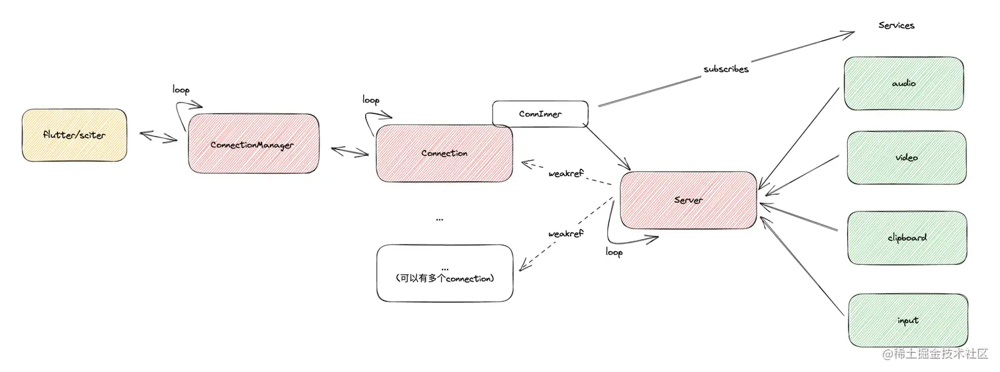

# RustDesk 源码梳理(转载)

[原文 link](https://juejin.cn/post/7183923556885987383)

## 项目结构

启用 feature:

- flutter
- flutter_texture_render

vcpkg: 安装音视频库依赖

- flutter 目录下为 flutter 界面代码
- libs 下为第三方库, 或某些额外 feature 的代码
  - libs/hbb_common 存放了一些公用代码和 pb 消息定义 src 就是软件主要代码目录

---

- client: 为控制端

- server: 为受控端(注意与连接服务器做区分)

- ui_xx_interface: 为 rust 代码与前端(flutter)通讯的接口, flutter 版本使用 dart:ffi + flutter_rust_bridge_codegen (基于现有库子维护的子分支, 可以看到 rustdesk 维护了一堆相关的依赖库, 可以说对 rust 桌面开发填了许多坑)

- rendezvous: 是与连接服务器通讯相关 ([服务器代码](rustdesk/rustdesk-server: RustDesk Server Program (github.com)), 也是 rust 开发并开源的, 可以支持自定义服务器)

- lang: 为简单的国际化方案, 将所有翻译组成 hashmap, 根据用户本地环境和配置(libs/hbb_commom/src/configs 中)选择翻译

- platform: 为平台相关代码, 这部分通常是与平台特性,限制相关的代码

- core_main: 为入口函数, 通过不同的参数来选择各种行为, 如 windows 下的安装, 更新, 及通用的后台启动, 默认为启动 server.

- ipc: rustdesk 会为很多耗时/后台任务启动单独线程(如 server),
  因此封装了 ipc 模块来做线程间通信, 它基于[parity-tokio-ipc]([open-trade/parity-tokio-ipc: Parity tokio-ipc (github.com),
  通过创建临时文件+socket 的方式, 一端创建信道, 一端连接, 来进行双向通信, 并支持前缀的方式区分不同通信渠道, 所有数据都封装在 ipc:Date 枚举中

- ui: sciter 版前端代码

## 流程



### 注册服务器

每一个 rustdesk 软件启动后, 都会开启受控端 server, 在 server:start_server 函数中, server 启动时代码

```rust
std::thread::spawn(move || {
 if let Err(err) = crate::ipc::start("") {
  log::error!("Failed to start ipc: {}", err);
  std::process::exit(-1);
 }
});
crate::RendezvousMediator::start_all().await;

start_all代码会做下面几件事
```

- check_zombie 回收子进程
- new_server 创建一个 ServerPtr, 这是一个受控端 server 的 instance, 在后面会用到
- test_nat_type 检查 nat 类型
- direct_server 本地开启 tcp 监听直连请求
- start_listening 本地监听 lan 局域网 peer 发现请求
- 主循环, 该循环通常不会退出, 每次循环体将重设延迟数据, 之后对配置中的所有连接服务器做通信
- 与连接服务器的通信循环在 start 函数中

具体的, 在于中继服务器通信循环中, 有两个事件,
`timer.tick` => 每隔 1s 向连接服务器发送 RegisterPeer 消息(register_peer), 如果通信超时则更新延迟信息, 通过全局变量 SHOULD_EXIT 控制退出
socket.next => socket 是与服务器建立的 udp 连接, 消息类型是 RendezvousMessage, 首先会处理到 RegisterPeerResponse, 如果服务器没有找到本地的公钥, 则会要求本地通过 RegisterPk 发送, 随后响应 RegisterPKResponse, 剩余的消息类型如果后续又遇到再关注.

### 连接流程

#### 前端发起

我们以 flutter 桌面版代码中发起连接为起点:
common.dart: connect -> connectMainDesktop -> rustDeskWinManager.newRemoteDesktop,
使用 window_manager 来支持 flutter 桌面版多窗口和窗口之间的通信.
multiwindow 会重新跑一遍 flutter 的 main 函数, 并加上 multi_window 参数
main.dart: main-> runMultiWindow -> DesktopRemoteScreen(开启 keyboard 监听) -> ConnectiomTabPage (注册 multiwindow 通信) -> DesktopTab -> RemotePage
这里的代码猛一看不是很清晰(可能是前端代码的通病:), 我们重点关注 initState 函数, 它创建了一个 FFI 对象, 调用了它的 start(id) 函数, 这个 id 就是我们从 connect 中一路传过来的, 通知 rust 开始连接 peer, 并调用 ffiModel.updateEventListener 来注册消息处理, 并且我们可以从\_ImagePaintState 中看到窗口大小, 与视频图像也是从 ffi 的 ImageModel 和 CanvasModel 中获取的
ffi.start 代码在连接模式(还有文件传输/portForward/rdp 模式)下如下:

```dart
/// Start with the given [id]. Only transfer file if [isFileTransfer], only port forward if [isPortForward].

void start(String id,
  {bool isFileTransfer = false, bool isPortForward = false}) {
 assert(!(isFileTransfer && isPortForward), 'more than one connect type');

 chatModel.resetClientMode();
 canvasModel.id = id;
 imageModel.id = id;
 cursorModel.id = id;

 // ignore: unused_local_variable
 final addRes = bind.sessionAddSync(
   id: id, isFileTransfer: isFileTransfer, isPortForward: isPortForward);
 final stream = bind.sessionStart(id: id);
 final cb = ffiModel.startEventListener(id);
 () async {
  await for (final message in stream) {
   if (message is Event) {
    try {
     Map<String, dynamic> event = json.decode(message.field0);
     await cb(event);
    } catch (e) {
     debugPrint('json.decode fail1(): $e, ${message.field0}');
    }
   } else if (message is Rgba) {
    imageModel.onRgba(message.field0);
   }
  }
 }();
 // every instance will bind a stream
 this.id = id;

}
```

bind 就是真正的 rust 桥接代码, 通过 generated*bridge.dart <=> flutter_ffi,
这段代码先调用 sessionAddSync 和 sessionStart 开启对端连接, 并获得一个异步流, 并通过 ffiModel.startEventListener 处理异步流中的事件消息(同 ffiModel.updateEventListener), 对于 Rgba 直接更新到 imageModel.
session 添加和启动的代码在 flutter.rs 中, session_add 会创建 Session<FlutterHandler> 对象, 并添加到全局变量中, session_start*则启动线程跑 session 的 io_loop.
这里的 session 在 ui_session_interface 中, 如我们前文所述, ui_xx_interface 会负责 rust<->flutter 通信, 在这个文件中, 是通过 InvokeUISession : 调用 ui (有 flutter 实现和 sciter 实现), 与 Interface : 向外提供的接口, 两个 trait 实现的.
在 session 的 io_loop 中, 使用 start_video_audio_threads 创建音视频处理线程, 之后创建 client/io_loop:Remote 对象, 开启 client 的 io_loop
总结一下: 在用户点击连接按钮后, 新建一个对应的 flutter 连接窗口, 并创建对应 ui 页面, 随后调用 rust 创建 ui_session_interface 对象, 绑定好两边的通信关系后, session 开启 io_loop, 并真正发起连接.

#### 网络协商

在 client/io_loop:io_loop 中, 首先会调用 Client::start, 与连接服务器通信, 从而与 server(受控端)建立 socket 连接.

```dart
_start() {
 // 1. 判断id是否是ip, 如果是ip则直接直连tcp返回
 // 2. 选择一个 rendezvous server(连接server)
 // 3. 重试3次, 向连接server 发送 PunchHoleRequest
 //    并根据server响应 PunchHoleResponse/RelayResponse
 //    进行nat直连/中继连接
 // 4. 直连: connect => (如果直连失败) request_relay => secure_connect
 // 5. 中继连接: create_relay => secure_connect
}

// 该函数负责ssl握手
// 基于 sodiumoxide
// 这里结合server中的create_tcp_connection代码来看
secure_connect() {
 // 1. server -> client
 //    server 生成临时 keypair,
 //    用持久化秘钥签名 id 和 临时keypair 的公钥
 //    发送 SignedId 消息
 // 2. client
 //    获取参数中的公钥/默认公钥
 //    接收 SigendId 消息
 //    利用公钥解出 SignedId 中的 id 和 server 临时公钥
 //    生成本地临时 keypair, 使用 secretbox::gen_key 随机生成本地加密会话的对称key
 //    seal => keypair秘钥 + server keypair 公钥 加密 对称key
 //    发送 PublicKey 消息, 包含本地keypair公钥和加密后的 对称key
 //    设置会话秘钥
 // 3. server
 //    接收 PublicKey 消息,
 //    利用临时私钥和 PublicKey中的 client 公钥, 解密 对称key
 //    设置会话秘钥
}
```

客户端的连接已经完成, 我们再向前回退一点, 来到服务端的 RendezvousMediator loop, 当收到 PunchHole 消息进行 handle_punch_hole 打洞连接, FetchLocalAddr 消息进行 handle_intranet 内网直连, 在这两个函数中受控端会向连接服务器返回 id, 网络地址, 版本, 中继 server 等信息. 并调用 accept_connection 函数准备接收控制连接. 在接收到连接 socket 后, 在 create_tcp_connection 中协商秘钥, 最终在 server/connection.rs:Connection 的 start 开启 server loop.

#### 受控端初始化

在 server loop 之前, server 还需要完成受控端的初始化,
start 中调用 start_ipc 中开启 connection manager 进程(与该进程通信同样使用 ipc 机制), rustdesk 中多缩写为 cm, 该进程以 "--cm" 参数区分, 然后在 core_main 函数中转发给 start_listen_ipc_thread(flutter), 创建 ConnectionManager(ui_cm_interface), 开启 cm ipc 监听

这里有一个小细节,

1. start_ipc 创建进程,
2. cm 进程监听 ipc,
3. start_ipc 连接 ipc,

这样直接可以通过连接 ipc 的结果判断进程是否创建成功.

连接完成后, 我们终于获得了 tcp 流. 分别在 server/connection, client/io_loop 中开启受控端和控制端的 io_loop. 但 rustdesk 逻辑上的连接还没有完成, 在真正可以传输数据之前, 我们还需要经历一段登录验证逻辑, 客户端输入密码, 服务端验证, 这里的逻辑并不是我们的重点.
直接进入验证成功后, 服务端的 send_logon_response 函数, 这里会创建 PeerInfo 作为登录成功的响应, 随后尝试激活屏幕(后台运行时, 服务端可能已经锁屏), 获取显示器信息(多显示器). 随后为 ServerPtr(服务器启动时创建的)添加一个新的 connection. 此时我们回头研究一下 server 的代码.

```rust
pub struct Server {
 connections: ConnMap,
 services: HashMap<&'static str, Box<dyn Service>>,
 id_count: i32,
}

pub type ServerPtr = Arc<RwLock<Server>>;
pub type ServerPtrWeak = Weak<RwLock<Server>>;


pub fn new() -> ServerPtr {
 let mut server = Server {
  connections: HashMap::new(),
  services: HashMap::new(),
  id_count: 0,
 };

 server.add_service(Box::new(audio_service::new()));
 server.add_service(Box::new(video_service::new()));
 #[cfg(not(any(target_os = "android", target_os = "ios")))]
 {
  server.add_service(Box::new(clipboard_service::new()));
  if !video_service::capture_cursor_embeded() {
   server.add_service(Box::new(input_service::new_cursor()));
   server.add_service(Box::new(input_service::new_pos()));
  }
 }
 Arc::new(RwLock::new(server))
}
```

Server 只保留了 id 信息, connectionMap(存放 connInner, 作为与 connection 传输数据的渠道)和 servicesMap, 通过不同 service 来实现屏幕抓取(video_service), 音频抓取(audio_service)等受控端功能. Service 的实现是订阅者模式, 当 Service 产生数据后发送给自己的订阅者(connInner), 从而解耦解决 Rust 单一所有权问题.

这里与前文的 loop+select 结合就是 rustdesk 中的一个代码范式, 每个功能都开启单独线程+tokio 异步运行时, 在一个无限循环中, 异步处理事件, 事件的来源可以来自

1. socket: 来自网络, 对端或连接服务器的消息
2. ipc: 不同线程, 进程之间的通信, 消息量较少
3. timer: 定时/重复任务
4. channel: 这里的订阅者, flutter call rust, 等功能.

相信理解了这个范式就可以更好的理解 rustdesk 的代码了.



### 流传输

视频流传输需要经过

视频采集

- 图像编码(optional: 录屏)
- 图像传输(VideoFrame 消息)
- 其中前两项步骤通过 libs 下源码依赖的 scrap

控制流可以也有多种

- 配置 (这个流可以是多向的, 我们暂时忽略)
- 键盘: KeyEvent
- 鼠标: MouseEvent 鼠标点击事件, CursorData 自定义鼠标 CursorPosition 鼠标位置, cursor_id 多鼠标

键盘和鼠标的控制信号模拟都是使用 libs/enigo, 同样是自己魔改的 enigo-rs, 这是一个跨平台的输入模拟库, 魔改后加入了 rdev
鼠标需要双端同步位置, 控制端在前端测采集, 调用 send_mouse, 受控端在 input_service 中处理, 直接调用系统 api 监听,
键盘事件在 handle_input->handle_mouse 中处理, 值得注意的是键盘映射和控制 key 的存储.
