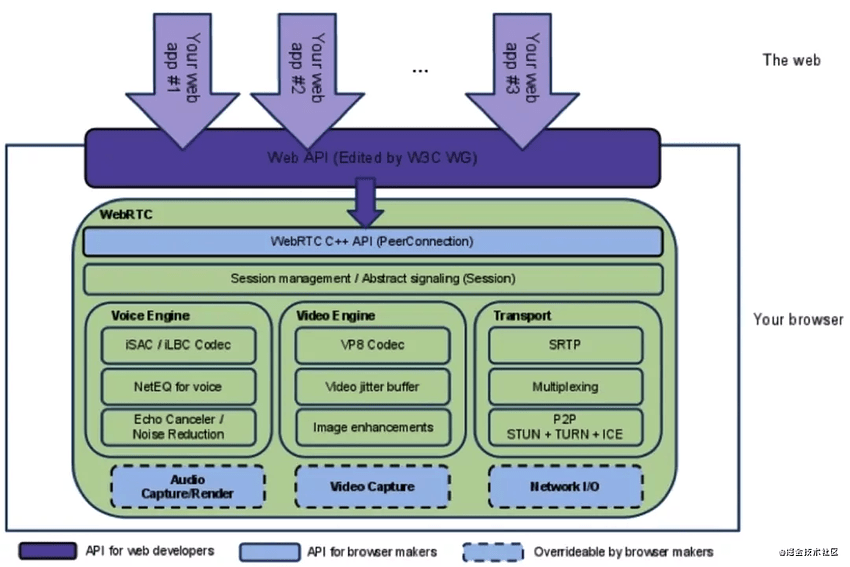
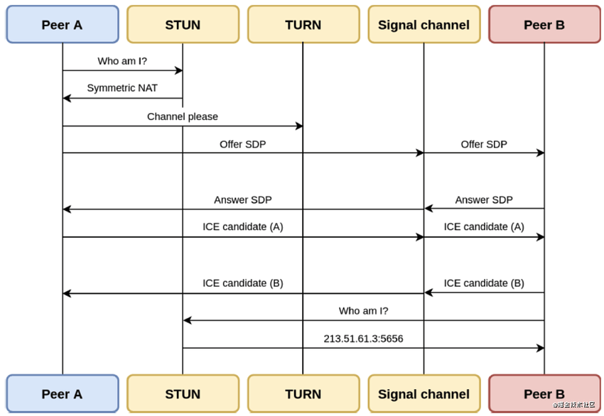

# 前言

近几年实时音视频通信应用呈现出了大爆发的趋势。在这些实时通信技术的背后，有一项不得不提的技术——WebRTC。

今年 1 月，WebRTC 被 W3C 和 IETF 发布为正式标准。据调研机构 GrandViewReseach 的报告显示，预计 2025 年全球 WebRTC 市场规模将达到 210.23 亿美元，相较 2019 年 23 亿美元的市场规模，5 年的复合年增长率为 43.6％。

本系列内容将和大家一起来探讨，为什么 WebRTC 受到开发者及企业的青睐 ？未来 WebRTC 又将如何发展？以及声网Agora 是怎样基于 WebRTC 进行二次开发，又将如何支持 WebRTC NV 版本的？

WebRTC可以被看作是一个不需要安装任何插件或者下载任何额外程序就能运行的浏览器原生实时通信手段。不同的客户端通过（相同或不同）浏览器跳转到同一个 URL 就能实现实时互通、看见彼此。但这只是“上帝视角”的说法，其中包含的技术框架和实现细节远没那么简单。

# 基本概念

在我们开始讨论 WebRTC 是如何工作之前，先来理清几个关键的技术概念。

## P2P

可以实现实时点对点音视频（即多媒体）通信是 WebRTC 最为显著的一个特征。为了通过 Web 浏览器进行通信，要求每个人的 Web 浏览器都需要同意“开始接通”，知道对方的网络定位，并且还需要绕过网络安全和防火墙保护并实时传输所有多媒体通信才能够得以实现。

在基于浏览器的对等通信中，如何定位和建立与另一台计算机的 Web 浏览器的网络连接并进行高效数据传输是其最大的挑战之一。

当你想要访问一个网站时，一般都是直接输入网址或者点击连接跳转来进行页面查看。在这个过程中，其实是你向通过提供网页（HTML，CSS和JavaScript）进行响应的服务器发出了一个请求。而发出这个访问请求的关键是你向已知且易于定位的服务器（通过DNS）发出HTTP请求，并获得响应（即网页）。

乍看之下，好像这个问题也没那么难，但我们举个例子来看看：现在假设我想和同事进行视频沟通。那我们怎么才能发出请求并实际直接接收到对方的音频和视频数据呢？

上述场景中出现的问题就可以通过 P2P（点对点传输）技术来解决，而 WebRTC 本身就是基于点对点（Peer-to-Peer）连接的，其中的 RTCPeerConnection就是负责建立 P2P 连接以及传输多媒体数据的 API。

## 防火墙和 NAT 穿透

日常生活中，我们大都是通过工作或家庭网络进行互联网访问，这时候我们的设备通常是在防火墙和网络访问转换设备（NAT）的后面，因此并没有分配静态的公共 IP 地址。更进一步来看，NAT 设备会将防火墙内部的私有 IP 地址转换为面向公众的IP地址，以确保对可用公共 IP 地址的安全性和 IPv4 限制。

让我们带入上一个例子来看看，考虑到 NAT 设备的参与，我怎么才能知道同事的 IP 地址，将音频和视频数据发送到这个地址，同样，他怎么知道我的IP地址可以将音频和视频数据发送回去? 这就是 STUN（Session Traversal Utilities for NAT，NAT会话穿越应用程序）和 TURN（Traversal Using Relays around NAT，中继穿透 NAT）服务器要解决的问题.

为了使 WebRTC 技术正常工作，首先会向 STUN 服务器请求一个面向公众的 IP 地址。如果这个请求得到了回应，并且我们收到了面向公众的 IP 地址和端口，就可以告诉其他人如何直接和我们建立连接。而别人也可以使用 STUN 或 TURN 服务器执行相同的操作。

## 信令&会话

由于存在 NAT，WebRTC 不能直接与对端建立连接，因此设备之间需要通过信令服务进行发现和协商以进行实时的音视频交换。上述的网络信息发现过程是更大层面上的信令主题之一，在WebRTC 的情况下，它是基于 JavaScript 会话建立协议（JSEP）标准的。信令涉及网络发现和 NAT 穿透，会话创建和管理，通信安全和协调以及错误处理等。

WebRTC 并没有规定信令必须使用何种实现，这是为了让开发者所用技术和协议可以更加灵活。

目前业界使用较多的是 WebSocket + JSON/SDP 的方案。其中 WebSocket 用来提供信令传输通道，JSON/SDP 用来封装信令的具体内容：

WebSocket 建立在 TCP 之上，提供了长连接的能力，解决了 HTTP 仅支持半双工，Header 信息冗余等低效问题。WebSocket 允许服务器和客户端在任何时间推送消息，而与先前的请求没有任何关系。使用WebSockets的一个显着优势是，几乎每个浏览器都支持WebSockets。

JSON 是一种 Web 领域常见的序列化格式，用来封装一些用户自定义的信令内容。（本质是序列化工具，所以类似 Protobuf/Thrift 这样的方案也完全可行）。

SDP（Session Description Protocol）是一个会话描述性协议，用来封装流媒体能力协商的信令内容，两个 WebRTC 代理会将建立连接所需的所有状态通过此协议来分享 。

如果概念性的内容不太好理解，那我们可以把它想象成一个日常交流过程：

当我们准备和一个陌生人进行交流或者一个陌生人希望加入你的聊天，那当你或者对方发出了这个信息，不管你是接受还是拒绝都需要与对方交换这个信息。你们只有交流后才有可能能获更多信息来判断是否你们可以一起愉快地聊天。而帮你快速汇总这些信息的就是 SDP （会话描述协议），它包含了例如使用的是什么代理，它支持什么硬件，它想交换什么类型的媒体等信息。

那当两个人想要开始聊天时总需要有一个人先开口

> Me：我讲中文，17岁，高中，喜欢打篮球，现在想学英文，所以想跟你聊聊天看看能不能帮助我提高英文（即 Offer SDP）。
>
> Peer：我讲中文，23岁，工作，喜欢打篮球，英文一般，不一定能帮到你但我们可以一起打球（即 Answer SDP）。

这个交换信息、相互了解的过程目的是为了确认我们是否可以进行下一步交流，或者我们完全没办法进行交流。谁先发出信息并不重要，重要的是不管谁发出了信息即便是出于礼貌我们也需要给予对方一个回应，这样这个对话才可能有效。

## 相关协议

协议是个标准/约定，而协议栈是协议的实现，可以理解为代码、函数库、供上层应用调用。WebRTC 中的协议栈是已经写好了底层的代码，符合协议标准，提供给开发者一个功能模块进行调用的。开发者需只需要关心应用逻辑，数据从哪里到哪里，怎么存储，处理系统里设备之间的通信顺序等即可。

WebRTC利用多种标准和协议，包括数据流，STUN / TURN 服务器，信令，JSEP，ICE，SIP，SDP等。

WebRTC 协议栈

信令

- 应用层：WebSocket/HTTP
- 传输层：TCP

媒体流

- 应用层：RTP/RTCP/SRTP
- 传输层：SCTP/QUIC/UDP

安全

- DTLS：用于协商媒体流的密钥
- TLS：用于协商信令的密钥
- ICE（交互式连接建立）
- STUN
- TURN

其中 ICE（Interactive Connectivity Establishment，互动式连接建立），STUN 和 TURN 是建立和维护端到端连接所必须的。DTLS 用于保护对端的数据传输。SCTP 与 SRTP 则被用于为多路复用、提供拥塞和流控制，以及部分在 UDP 之上提供部分可靠的传递和其他附加服务。

# 基本架构

通过以上介绍，相信大家对于 WebRTC 中的一些关键概念都有了理解。那接下来，让我们一起来看看 WebRTC 的最关键的基础组件架构，这对于我们后续理解 WebRTC 的工作原理同样十分重要。

基本组件架构

WebRTC 的组件架构分为两层：应用层和核心层。上图中的绿色部分显示的是 WebRTC 提供的核心功能，而深紫色部分是浏览器提供的 JS 的 API（即浏览器对 WebRTC 核心层 C++ API 做了一层封装，封装成了 JS 接口）。

图片最上面的浅紫色指入箭头是上层应用，可以在浏览器中直接访问浏览器提供的 API，最终调用到核心层。

而关于核心功能层，主要是有 4 部分：

- C++ API 层

API数量较少，主要是PeerConnection。而 PeerConnection 的 API又包含传输质量、传输质量报告、各种统计数据、各种流等。（设计技巧：对于上层来说，提供的 API 简单，方便应用层开发；内部比较复杂。）

- Session 层（上下文管理层）

如应用创建了音频、视频、非音视频的数据传输，都可以在 Session 层做处理，做管理相关的逻辑。

- 引擎层/传输层（最重要、核心部分）

  这部分分为 3 个不同的模块：Voice Engine（音频引擎）、Video Engine（视频引擎）以及Transport（传输模块），可用作音视频传输解耦。

  **Voice Engine（音频引擎）** 包含了如音频采集、音频编解码、音频优化（包括降噪、回声消除等）等一系列的音频功能。

  - ISAC/ILBC 编解码；
  - NetEQ （Buffer） 网络适配、防止网络抖动；
  - 回音消除（echo canceler）：音视频重点，决定产品质量，WebRTC里提供了相关非常成熟的算法，开发时只需要调节参数即可；降噪（Noise Reduction）、自动增益。

  ***\*Video Engine\**（视频引擎）** 包含了如视频采集、视频编解码、根据网络抖动动态修改视频传输质量、图像处理等。

  - VP8、openH264 编解码；
  - Video jitter buffer：防止视频抖动；
  - Image enhancements：图像增强。

  **Transport（传输模块）** 在WebRTC中，对所有的音频视频进行接收与发送，传输层包括了泄漏的检测、网络链路质量检测，根据情况估算网络带宽，根据网络带宽进行音视频、文件等非音视频的传输。

  - 底层用的UDP，上层用的SRTP（即安全的、加密后的RTP）；
  - Multiplexing：多个流复用同一个通道；
  - P2P层（包括 STUN+TURN+ICE）。

- 硬件层

  - 视频采集、渲染；
  - 音频采集；
  - 网络IO等。

WebRTC的核心层中是没有视频的渲染的，所有的渲染都需要浏览器层自己做。

# 工作原理

WebRTC 中其实涉及了许多复杂的技术议题，比如音频采集、视频采集、编解码处理器等。由于我们本章内容是希望可以为大家呈现一个简单易懂的 WebRTC 工作流程是，因此关于更多 WebRTC 技术的实现细节在本章我们先不一一讨论，如果感兴趣的小伙伴可点击进入#WebRTC#专栏自行查看。

我们在第一部分的内容Why WebRTC｜前世今生中有提到“WebRTC 对于开发者而言是一套支持网页浏览器进行实时音视频对话的 W3C Javascript API”，这些JavaScript API实际产生并传输用于实时通信的多媒体数据。

WebRTC 主要的 API 包括 Navigator.getUserMedia（打开录音和摄像头），RTCPeerConnection（创建并协商对等连接）和RTCDataChannel（代表对等之间的双向数据通道）。

关于WebRTC的工作流程，我们从“如何实现一个 1 对 1 通话”场景来看可能会更直观一些：

1. 双方先调用 getUserMedia 打开本地摄像头；
2. 向信令服务器发送加入房间请求；
3. Peer B 接收到 Peer A 发送的 offer SDP 对象，并通过PeerConnection的SetLocalDescription方法保存 Answer SDP 对象并将它通过信令服务器发送给 Peer A。
4. 在 SDP 信息的 offer/answer 流程中，Peer A 和 Peer B 已经根据 SDP 信息创建好相应的音频 Channel 和视频 Channel，并开启Candidate 数据的收集，Candidate数据（本地IP地址、公网IP地址、Relay服务端分配的地址）。
5. 当 Peer A 收集到 Candidate 信息后通过信令服务器发送给 Peer B。同样的过程 Peer B 对 Peer A 也会再发送一次。

这样 Peer A 和 PeerB 就相互交换了媒体信息及网络信息，如果能达到一致(找到交集)，就可以开始通讯了。