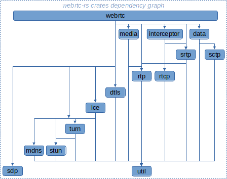
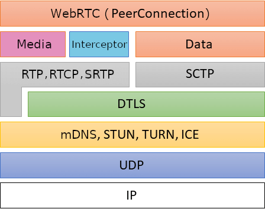

# Webrtc-rs

项目: https://github.com/webrtc-rs/webrtc





文: https://blog.tonari.no/why-we-love-rust

从头开始


因此，在一次讨论会上，我们认定从头开始重新实现整个技术栈是容易得多的路线。我们想要了解和理解在我们的硬件上运行的每一行代码，并且应该针对我们想要的具体硬件进行针对性设计。

 

因此，我们开始了全新的旅程，从浏览器或现有 RTC 项目之类的高级界面深入到更内核的部分，并从零开始进入了底层系统和硬件交互的世界。

 

我们需要系统本身具有足够的安全性，以保护 tonari 用户的隐私。我们需要它具有强大的性能，以使通话过程尽可能人性化和实时流畅。而且，随着新员工的不断加入，他们要学习我们的现有工作并在此基础上进行扩展，我们需要在代码变得更加成熟的同时使其具备良好的可维护性。

 

我们讨论并排除了一些选项：

 

安全性：C和C++的内存和并发都是不安全的，并且它们纷繁复杂的构建系统使我们很难获得一致且简单的开发体验。

性能：Java、C#和Go的内存管理是不透明的，在对延迟敏感的应用程序中，如果要完全控制内存，它们可能会很难用。

可维护性：Haskell、Nim、D和其他几种定制语言在工具链、社区和人才资源方面不尽如人意。

 

实际上在我们看来，Rust 是能满足这些需求的唯一一种可用于生产的语言。

 

从 Rust 开始


Rust 的优势来源于开发社区做出的无数决策。

 

它的构建系统是opinionated，而且设计简洁。它本身就是一个完整的生态系统，你可以轻松引导新工程师进入​​项目并建立开发环境。

内存和并发安全性保证简直不能更赞。我们相信，如果我们继续使用C++来开发，那么到现在都无法进行第一次部署——我们可能还是卡在许多细节上。

我们通过CUDA之类的API与硬件进行最底层交互的能力，通常是通过现有的板条箱（crate，Rust的代码库术语）实现的，这使我们有能力为第一个生产版本的延迟定下更高的标准。

 

随着 tonari 不断前进，我们现在选择的嵌入式微控制器的固件可以用 Rust 编写，因此我们就不用在不安全的编程系统旧世界上兴建世外桃源了。

我们依赖的工具箱


这里不谈 cat Cargo.toml，而是会专注于一些精挑细选过的工具箱。

“优于 std 的”工具箱


在几乎所有方面，crossbeam（https://github.com/crossbeam-rs/crossbeam）都比std::sync::mpsc更适合线程间通信，并且最终可能会合并到std中。

parking_lot（https://github.com/Amanieu/parking_lot）在几乎所有方面都具有优于std::sync::Mutex的mutex实现，并且某一天可能合并到标准库中。它还提供了其他许多有用的同步原语。

与Vec<u8>相比，bytes（https://github.com/tokio-rs/bytes）是一种更健壮且通常性能更高的字节处理方式。

如果你要进行底层网络优化，socket2（https://github.com/alexcrichton/socket2-rs）会是你的最终选项。

锦上添花


fern（https://github.com/daboross/fern）是一种自定义和美化日志记录输出的简单方法。我们使用它来保持日志的可读性和内部标准化。

structopt（https://github.com/TeXitoi/structopt）是你一直梦寐以求的CLI参数处理方式。除非你的依赖项几乎没有，否则没有理由不使用它。

Cargo 经典传奇


cargo-release（https://github.com/sunng87/cargo-release）使我们能够轻松减少内部版本。

cargo-udeps（https://github.com/est31/cargo-udeps）可以识别未使用的依赖项，并尽可能减少我们的构建时间。

cargo tree（最近集成进了cargo）显示了一个依赖树，它在许多方面都很有用，但主要用于找出最小化依赖项的途径。

cargo-geiger（https://github.com/rust-secure-code/cargo-geiger）帮助我们快速评估外部依赖，以解决可能的安全性（或正确性）问题。

cargo-flamegraph（https://github.com/flamegraph-rs/flamegraph）在跟踪代码中的性能热点时给了我们巨大的帮助。

项目结构


tonari 代码库是单体架构。从本质上讲，我们有一个带有 binaries 板条箱和许多支持库板条箱的 Cargo 工作区。

 

我们将工具箱放在一个存储库中，这样就很容易在我们的 binaries 板条箱中引用，而无需发布到 crates.io，或在我们的 Cargo.toml 中指定 git 依赖项那么麻烦了。当需要将这些库开源发布时，很容易就能把它们分解成单独的存储库

库，二进制，为什么不两者并用？


我们有一个主库，其中包含一个用来与硬件、媒体编解码器、网络协议等通信的统一 API。除了这个私有 API 外，我们在工作区中还有独立的板条箱，我们将这些板条箱视为开放源代码的候选人。例如，我们已经自行编写了适合长期运行的高吞吐量 actor 的 actor 框架，以及用于可靠、高带宽、低延迟媒体流的网络协议。

 

我们将不同的二进制文件用于 tonari 系统的不同部分，并且每个二进制文件都位于 binaries 中。它的库模块包含一组可重用的 actor，将我们的私有 API 与 actor 系统结合在一起，然后是消费这些 actor 并定义它们之间管道的单个二进制文件的集合。

视野所及的标志


我们广泛使用功能标志，以在不同的 OS（例如古老的 MacBook Pro）或不同的硬件配置上开发项目。这使我们能够轻松更换摄像头硬件，而无需进行额外的运行时检查或使用可怕的 sed 编程技巧。

 

例如，Linux 使用 v4l2（Video For Linux...2）来访问大多数网络摄像头，但是其他网络摄像头可能有自己的 SDK。要针对不使用 v4l2 的平台或在特定操作系统不可用的 SDK 进行编译时，我们可以将这些 SDK 放在功能标志后面，并导出一个公共接口。

 

举一个（简化的）具体示例，假设我们有一个定义为一个 trait 的通用摄像头接口：

 

pub trait Capture {
    /// Capture a frame from a camera, returning a Vec of RGB image bytes.
    fn capture(&mut self) -> Vec<u8>;
}
复制代码

 

假设我们有三种不同的摄像头界面：v4l2、corevideo 和 polaroid。我们可以让 binaries 专门针对此 trait 来获得灵活性，并且可以使用功能标志切换不同的 Capture 实现。

```rust
#[cfg(feature = "v4l2")]
mod v4l2 {
    pub struct V4l2Capture {
        ...
    }

    impl Capture for V4l2Capture {
        fn capture(&mut self) -> Vec<u8> {
            ...
        }
    }
}

#[cfg(feature = "corevideo")]
mod corevideo {
    pub struct CoreVideoCapture {
        ...
    }

    impl Capture for CoreVideoCapture {
        fn capture(&mut self) -> Vec<u8> {
            ...
        }
    }
}

#[cfg(feature = "polaroid")]
mod polaroid {
    pub struct PolaroidCapture {
        ...
    }

    impl Capture for PolaroidCapture {
        fn capture(&mut self) -> Vec<u8> {
            ...
        }
    }
}

#[cfg(feature = "v4l2")]
pub type VideoCapture = v4l2::V4l2Capture;

#[cfg(feature = "corevideo")]
pub type VideoCapture = corevideo::CoreVideoCapture;

#[cfg(feature = "polaroid")]
pub type VideoCapture = polaroid::PolaroidCapture;
```

 

如果让我们的代码与实现 Capture trait 的事物搭配，而不是与具体类型搭配，那么现在我们可以简单地切换功能标志来在各种目标平台上编译。例如，我们可以有一个结构，该结构具有一个字段 video_capture: Box<dyn Capture>，它能使我们存储可从摄像机 Capture 的任何类型。

 

一个支持上面我们编写的捕获实现的示例 Cargo.toml 文件可能是这个样子：


```toml
[package]
name = "tonari"
version = "1.0.0"
edition = "2018"

[features]
default = ["v4l2"]
macos = ["corevideo"]
classic = ["polaroid"]
v4l2 = ["rscam"]

[dependencies]
rscam = { version = "0.5", optional = true }     # v4l2 linux camera library
corevideo = { version = "0.1", optional = true } # MacOS camera library
polaroid = { version = "0.1", optional = true }  # Polaroid camera library (very slow FPS)
```


 

这样，我们就可以避免构建并链接到特定于平台的库，例如 v4l2 这样并非完全通行的选项。

在工作中学习 Rust


转换到 Rust 一年后，我们的第四位工程师加入了团队，他在 Rust 或系统工程方面都没有很多经验。虽然学习曲线是不可否认的，但我们发现 Rust 为那些刚接触底层编程的新手提供了惊人的力量。

 

如前所述，该语言内置的内存和并发安全性意味着一箩筐问题不仅是无法编译的，而且编译器本身往往就是你唯一需要的老师，因为它给出的警告解释得非常清楚。关于 Rust 出色的编译器消息以及出色的文档（https://doc.rust-lang.org/stable/book/）（可以看一下关于字符串的长长讨论，https://doc.rust-lang.org/book/ch08-02-strings.html），已经有很多文献做出了介绍。对于我们来说，这些都是非常有用的资源。 

 

与其他许多语言不同，在 Rust 中通常有一种显而易见的“正确方法”来做各种事情。并非以“正确方式”编写的代码往往会非常显眼，并且很容易在审核中挑出来，往往是由 cargo clippy 自动识别出来的。

 

实际上，这意味着新工程师可以快速开始贡献可用于生产的代码。代码审查可以继续专注于实现，而不是花费更多精力手动做正确性检查。

IDE 普查


在 IDE 部门中，我们发现 Rust 与某些前辈相比还相对不够成熟。尤其是今年，我们取得了长足的进步，每个人都找到了一个非常舒适的开发环境。

 

我们当中有1个人使用macOS，3个人使用Linux（Arch、Ubuntu和Pop!_OS，可见我们各自的受虐倾向）

我们当中2个人使用带有rust-analyzer插件的VS Code，2个人使用带有RustEnhanced的Sublime Text。

 

我们经常分享设置并互相尝试对方的环境（Brian 除外，他在 29 岁之后就停滞不前了），并且我们一直在关注可以帮助我们更好地协作的新开发工具。

代码风格指南已死，rustfmt 万岁


体验过狂野的开发人生吗？提交代码之前，我们没有必须阅读的代码样式指南文件。我们不需要这种东西。我们只是强制执行 rustfmt。告诉你吧：这确实是代码审查的前沿阵地。

 

我们如何审查代码


我们的代码审查非常简单，因为到目前为止我们只有四个人，而且我们很幸运在彼此之间赢得了很多信任。我们的主要目标是在每一行代码上至少有两对眼睛盯着，并且不要互相挡路，以便我们保持活力。

 

持续测试


我们使用谷歌的 Cloud Builder 来运行 CI 构建，因为我们的基础架构栈主要基于 GCP 构建，并且可以轻松调整构建机器规格和自定义构建映像。每次提交都会触发它，并运行 cargo clippy 和 cargo build。我们将-D warnings 传递给编译器，以将警告升级为错误，确保我们的更改不会在可怜的同事下次拉取更改时劈头盖脸迎来大堆 rustc 警告。

 

为了缩短配置项构建时间，我们将 target 和.cargo 目录缓存在 Cloud Storage 中，以便下次可以下载并增量构建。

 ```txt
 for crate in $(ls */Cargo.toml | xargs dirname); do
   pushd $crate
 
   # Lint.
   cargo +$NIGHTLY_TOOLCHAIN clippy --no-default-features -- -D warnings
 
   # Build.
   time RUSTFLAGS="-D warnings" cargo build --no-default-features
 
   # Test.
   time cargo test --no-default-features
 
   popd
 done
 ```


我们也听说了关于 sccache（https://github.com/mozilla/sccache）的好消息，并将很快对其进行评估！

 

与现有的 C/C++库集成


Rust 生态系统很棒，但是有大量现有项目需要大量时间投入才能移植到 Rust。webrtc- audio- processing 就是一个很好的例子。它提供的好处（没有回声或刺音的清晰音频）很明显，并且不太可能在短期内将其移植到 Rust（它大约包含 8 万行 C 和 C++代码）。

 

值得庆幸的是，Rust 很容易使用现有的 C 和 C++库。bindgen（https://crates.io/crates/bindgen）这个板条箱完成了大部分繁重的工作。给它一个用 C 或 C++编写的头文件，它将自动生成（不安全的）Rust 代码，该代码可以调用头文件中定义的函数。到那时，由你决定是否创建一个更高级别的 Rust 板条箱，以暴露一个安全的 API。

 

对于具有简单或常用构建过程的库，这个过程中的大部分是相当自动化的。但是，创建更高级别的安全 API 很重要——bindgen 提供的 Rust API 不适合直接使用，因为它不安全且不太符合习惯。幸运的是，一旦有了更高级别的 API，你最后就可以将 C 库换成你自己的 Rust 版本，而板条箱的消费者并不会察觉其中的变化。

 

这些特性使我们可以使用很多永远没有原生 Rust API，或者需要数月或数年才能重新实现的 API 和硬件。底层 OS 库、大型代码库（如 webrtc- audio- processing）和制造商提供的相机 SDK 都可以用在我们的 Rust 代码库中，而无需将整个应用程序语言转移到 C++，同时仍然可以提供良好的性能。

 

C++专属的怪癖


一些 C++库很难直接从 Rust 对接。你必须将类型列入白名单，因为 bindgen 无法处理引入的一部分 std::*类型，它不适用于模板化函数和复制/移动构造器，以及此处（https://rust-lang.github.io/rust-bindgen/cpp.html）记录的其他许多问题。

 

为了解决这些问题，我们通常会创建一个简化的 C++头文件和源包装程序，以导出对 bindgen 友好的函数。这种工作要复杂一些，但与将整个库移植到 Rust 相比工作量要少得多。你可以在此处（https://github.com/tonarino/webrtc-audio-processing/tree/2a973929c3afbc24beea75aa235f3341a7be275a/webrtc-audio-processing-sys/src）查看这个包装器创建的示例。

 

由于 Rust 的所有生态系统以及 C/C++项目仅仅是对 bindgen 的调用，我们可以轻松访问现有的一些最高质量的软件包，而不必牺牲执行速度。

 

Rust 的痛点


Rust 并非没有问题。这是一种相对较新的语言，并且在不断发展，大家在评估向 Rust 的迁移选项时应该考虑到它的一些缺点。这里是我们总结的一部分痛点清单：

 

编译时间长。著名的xkcd漫画讽刺说等待Rust代码编译时可以去喝咖啡休息一阵儿，这是很真实的。例如，我们的代码库大约需要8分钟才能在中等性能的笔记本电脑上以非增量方式完成编译，但实际情况可能会更糟。Rust编译器有很多工作要做，以实施强大的语言保证，并且它必须从源代码编译整个依赖树。增量构建的情况会好些，但是一些板条箱附带了构建脚本，这些脚本可以拉出并编译非Rust的依赖项代码，并且在升级版本和切换分支时可能需要清除构建缓存。

库覆盖率。Rust的库生态系统已经相当成熟，但与C/C++相比覆盖范围还是有限。我们最终实现了自己的抖动缓冲区，并且还使用Rust的bindgen包装了多个C/C++库，这意味着我们的Rust代码中存在unsafe区域。不常见的项目往往会有少量的不安全代码，这恶化了学习曲线，带来了更多出现内存错误的机会。

Rust要求你首先编写正确和明确的代码。如果弄错了，编译器不会漏掉它的。如果你不太在意并发性和内存保证，那么开发时会感觉到速度缓慢，却并没有必要。但是，Rust开发人员一直在努力改善错误消息。它们友好且可操作，通常包含修复建议。良好的内存和并发基础模型还有助于更快地克服最初的驼峰，因此我们建议你花一些时间来真正理解语言及其保证。

Rust的类型推断器是如此强大，它使你有时感觉就像正在使用动态类型的语言一样。就是说，有时它并不能完全按照你想要的方式工作，特别是当涉及到泛型和deref coercion（https://doc.rust-lang.org/book/ch15-02-deref.html）时，你最后不得不四处摸索才能让这个推断器满意。这可能会带来挫败感，而团队中如果有人经历了这一学习阶段，那就太有帮助了。有了足够的耐心，这种挫败感通常会变成令人惊叹的时刻，可以加深我们对语言设计及其用途的理解，避免可能会引入的错误。

语言进化。Rust语言正在不断发展。某些语言结构（例如async）仍然是脆弱的，你可能会发现最好还是坚持使用线程和标准库。

 

选择 Rust 后，到目前为止的情况


到目前为止，我们没有发生与软件相关的停机，这既令人惊喜，又是 Rust 保证提供的安全性的证明。Rust 还使我们可以轻松使用高效资源来编写高性能代码——我们的 CPU 和内存使用率都是可预测且一致的。因为没有垃圾收集器，我们可以保证一致的延迟和帧速率。

 

我们维护 Rust 代码库的体验也很棒。对我们的代码库进行大量更改后，我们可以放心地对延迟部分进行重大改进。干净的编译并不总是意味着一切都会正常工作，但老实说，这种情况还是很平常的。

 

我们的最终成果是获得了可靠的产品，也不需要噩梦般的维护工作，并且可以符合我们要求的帧速率、延迟和资源效率的高标准。同样，很难想象如果没有 Rust，我们现在会是什么样子！

 

开源


到目前为止，我们已经开源了一个 FFI 板条箱（https://doc.rust-lang.org/nomicon/ffi.html），即 webrtc-audio-processing（https://github.com/tonarino/webrtc-audio-processing）。这是过去我们存储库中最高级的板条箱之一，在开源过程中还有更多类似的板条箱。

 

以后，随着我们发布更多代码，关于这个主题的内容将会越来越多。但有一件事情是不变的：在开源之前，我们私下创建的每个板条箱都已经做好了开源的准备。这种理念使我们板条箱之间的界限更加清晰，并鼓励我们更流畅地做出要将代码库中哪些部分开源的决策。

 

致谢


感谢团队大家到目前为止所做的努力，我们希望自己的经验能为那些刚入门 Rust 的新手，或那些具备 Rust 丰富经验但在不同环境中使用它的老鸟们提供一两个有用的参考。请随时在 hey@tonari.no 上给我们打招呼，或在 Twitter（https://twitter.com/heytonari）上给我们反馈。

 

原文链接：https://blog.tonari.no/why-we-love-rust